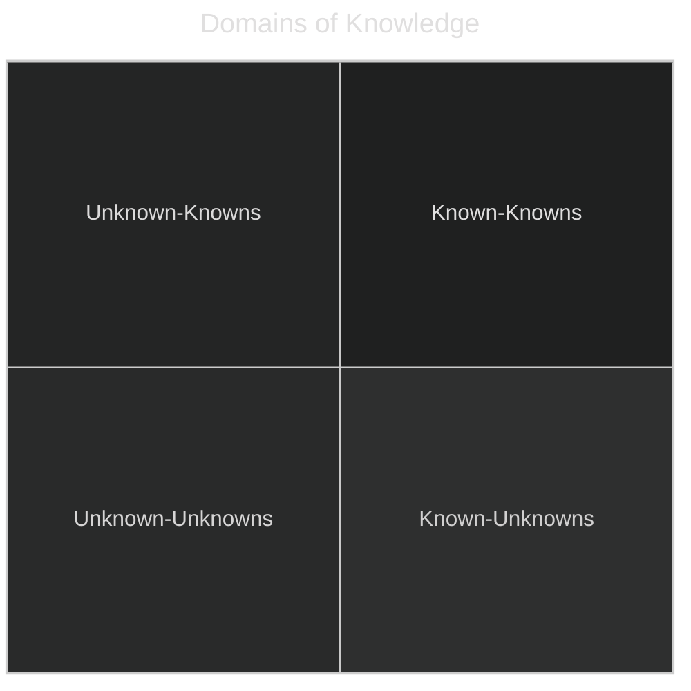
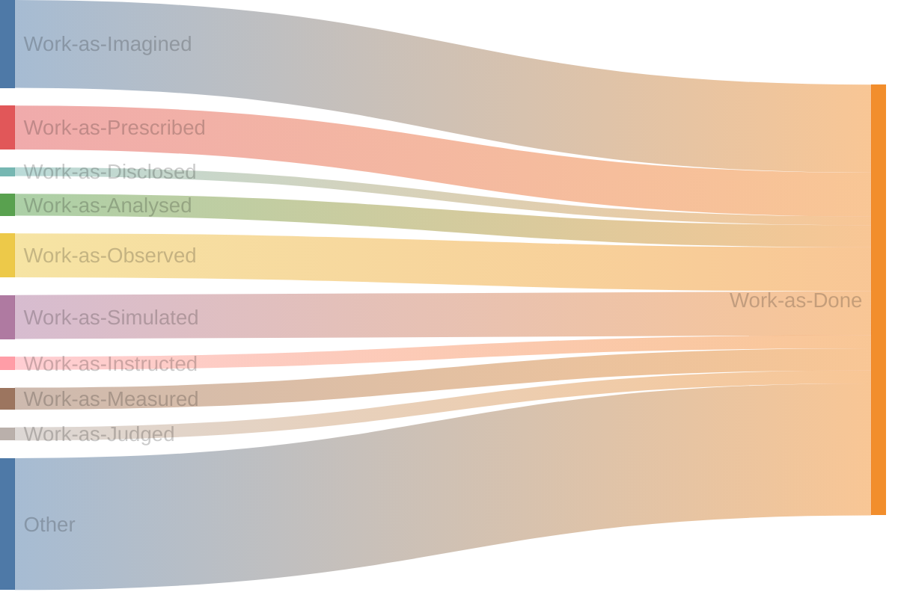

Most people have experienced working with someone that sucks the joy out of everything at some point in their lives. It's easier to confine the foulness of a single person in a way that mostly avoids you. It's harder to do when the person holds direct authority over you. Worse, is when an entire organization has a toxic culture. It leads to bad practices and leaders that passive about culture issues and unwilling to change anything because they're seen as not moving the needle in business objectives.

## Hazardous Waste

What makes a work environment toxic? A lot of things do but here are some specific things to call out in software engineering.

### Knowledge Differentials

Unnecessary discretion and keeping secrets. Yes it is possible that this is a job requirement because you work for the government on classified materials, in which this probably applies less to you. In order to work effectively in that kind of environment, you have to assume that people are acting with good faith. A lack of transparency will:

- slow down decision making
- weaponize knowledge
- increase risk of creating misaligned incentives

Transparency comes in two varieties, active and passive. Passive transparency might be worse than no transparency because it's pretending to do something it's not while giving people a valid claim to say they're still giving you what you want. Passive transparency is having information available, but a person has to specifically request it. It does not sound sinister, but it is easy to weaponize by creating large knowledge gaps.

No transparency and passive transparency unnecessarily add to quadrant 3; anyone that does not know what questions to ask for or where to find information or even the existence of information, will not find it. Unknown-unknowns move to quadrant 1 or 4 by stumbling on them. Knowledge in both passively transparent and opaque organizations are largely transfered with intent, the only difference being the level of explicitness.

By contrast, active transparency is going out of your way to make sure everyone knows about information and making it easy to access and find. This makes for a much better environment because it significantly reduces knowledge differentials. When information is withheld, it's the worst of all. Knowledge differentials is a form of office politics. Withholding information to gain advantage, whether in public through something like perceived competence, or information leading to more effective work output. Holding knowledge hostage should be avoided. It slows decisions down considerably and creates a zero-sum game type culture, internal to the company.

### Process Tycoons

Prioritizing processes over people is the pathology. A lot of companies are breaking the first two rules:

$$
\text{A process that works does not make it good.}
$$

$$
\text{A process that works does not make it good.}
$$

Speaking from the engineering side -- poor processes lead to bizarre failure modes. Ones where written processes work most of the time have failure modes that result in updates to add more process to account for those failure modes. A death spiral to avoid!

As a personal example, I once worked in an organization that had a SDLC (software development life-cycle) that was 13 pages long; it contained no diagrams, a real wall of bulleted text. Engineers would routinely fail to follow all the steps in the SDLC. It was doing too much since the document was also meant to be something similar to a runbook. In particular, the release portion of this document, after _verifications_ were considered complete in a _non-prod_ environment, had some glaring issues. The same failure mode occurred on multiple occasions, and during the incident review meetings after pointing out these issues things changed for the worse by... extending the document. There were many pathologies at this organization but the process bits were clear. The SDLC and its runbooks were ineffective when considering the whole system. They needed to provide more guardrails to people doing deployments. The SDLC and the runbooks needed to be different documents. They also needed to remove excessive manual toil.

Another process issue that creeps in and becomes more nuanced is requiring group consensus to do every. single. work. item! In software engineering, coming across _agile_ is almost a certainty at some point. It's practiced in different ways, in different places, with different meanings, and styles. Scrum is probably the most common methodology in product teams.

Scrum can be weaponized against teams. Story planning and grooming are mechanisms for work to be put into some queue. The problem story planning can devolve into is trying to bake a solution into the ticket. There's nothing wrong with giving people direction or guidance when needed but when the entire team sits around arm chairing solutions it's not productive for granular work. Breaking down big projects, sure. Coming up with coherent design strategies is one thing but the minutiae of every day work should be left to engineers to solve. This is their job. The high level description of the job to be done and the exit criteria should be sufficient. Grooming is assigning some value of work to these tickets describing something about the difficulty of the ticket. The next way to weaponize scrum is to require all work and tickets in a sprint flow through this type of workflow. If strict about the work done on a ticket, this means that and improvements will be isolated from that work and moved into a new ticket, by which must now be defined in a story, pulled into a sprint, and groomed. Everything follows this flow, which makes quality of life improvements very difficult to pull off or justify. I've yet to see a manager that actually set aside 20% of _some unit of time_ to make meaningful improvements when they make the scrum process this strict.

This is a case where process forgets the people. There was no flexibility in the process which made it hard to improve anything without breaking the rules. But there were so many other rules to prevent deviating that nothing beyond what was prescribed got done which meant no QoL improvements. This approach is slow and cumbersome at best and destructive at worst. It's fine to track work, but it's also beneficial to be flexible with how work gets accomplished. Anything that involves risky operations should contain guardrails of some sort, beyond that, let people be creative, get out of their way, and let them work!

Process pathologies seem to result from differences in _work-as-imagined_ vs. _work-as-done_. If unfamiliar with the concept, [Steven Shorrock](https://humanisticsystems.com/2016/12/05/the-varieties-of-human-work/) has a great book and blog post on this. Essentially, how work actually gets done is different than how work is thought of or expressed in a variety of ways. This loosely shows the relationship between the proxies for viewing work and how close it relates to the action:

### We Value Your Feedback--LOL

Actionable feedback is incredible, it gives the receiver a valuable piece of information that allows them to improve should they choose to align with it. People and organisations that choose inaction or punishment will stop receiving it. The message being sent is clear; there are top-down directives from a hierarchal order of authority to follow.

For example, I remember having a one-on-one with a former manager and that meeting ended up being yet another work synchronization meeting. This was essentially discussing the same topics as other public team meetings (of which there were three), and was held for a hour at a weekly cadence. I said that I don't get value out of the one-on-ones and would rather have a half hour meeting every two weeks instead, since I could never get the topics to shift and was already used to that cadence coming from a different team.

Instead of having a conversation about how to make these meetings a more valuable use of time or shifting cadence, I was passively denied, no change was ever made but I did get a new weekly meeting added to my calendar to synchronize more of the same work items discussed in three other public meetings. Perhaps I was a bad communicator? Perhaps my work wasn't broken down enough? I'll never know since it was never discussed. However, my feedback went both ignored and punished.

If you're not high up on the food chain, there's no solution here, cut your losses. If you are an influential leader, it is still difficult to break bad cultural norms once they're established without intentionality and support from other leaders.

### One of Us

Treating individuals differently. To some degree this is inevitable, but wildly different behaviors for different people in similar roles is absolutely unacceptable. For instance, allowing one person to deviate from a process because they fit in or are liked more than another. Rules and processes need to apply equally to everyone, otherwise favorites automatically become more effective giving them unfair advantage along multiple axis. Is the person a 10x engineer because they're good or because they're empowered where other people are not? This matters because it's possible to make an entire team of people more effective rather than a single individual, by adjusting those nepotism dials.

How people are treated matters. Being gaslit into nice perks is not the same as having the psychological safety to speak your mind. Being accepted by colleagues needs to happen or relationships break down and the politics begin.

For example, one org had their people promoted to the highest positions based on length of tenure, instead of proven credentials. My first month on a new team I asked the sole staff engineer for an overview of the product's architecture. This team was small. One concern I brought up was about signed integer ID values in a MySQL database, noticing it had a legacy PHP application still in tact. The staff engineer immediately said they don't have any signed integer IDs so I shouldn't worry about it. Then when doing performance testing and running into issues with the database, I ended up analyzing the schemas. Sure enough, it was a mixture of a lot of stuff but in it, were the signed integer values.... It was in that moment that I knew I could not trust the technical leadership. They could build things, but no one actually did more than read stack overflow to get answers to their questions without doing the hard work of understanding how anything actually worked. It's a brutal assumption that mostly ended up being correct. The problem is that when unqualified people become technical leaders, it diminishes the real work being done by people who deserve to be recognized. Eventually someone will notice and it will be a problem.

## Root of Trust

Toxic work environments rot trust at the root. Trust is the foundation of all positive human relationships. When that erodes, building it back is hard. Sometimes businesses need to make hard decisions that will affect morale, but they don't need to affect trust.

It's hard to learn in toxic environments. Even valid criticism can be more difficult to take seriously, because your guard is always up making it more difficult to have conversations about improvement while everyone is trying to smell the weakness in each other. For this reason, I say leave. It's not worth it to be in a toxic environment or to try and fix one. It will slow your progress and eliminate any joy left in work.

The best organizations are ones where I didn't have to worry about my performance and could focus on the job. The ones with less politics involved. I remember being a part of a highly functioning team and it's very addicting. When that goes away, its hard to figure out how to bring it back.
