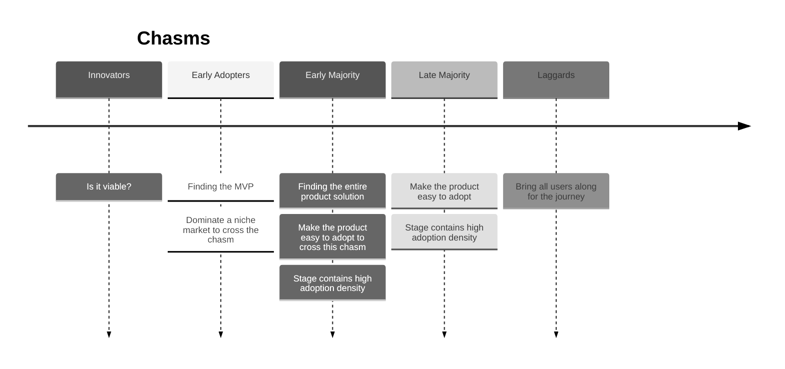
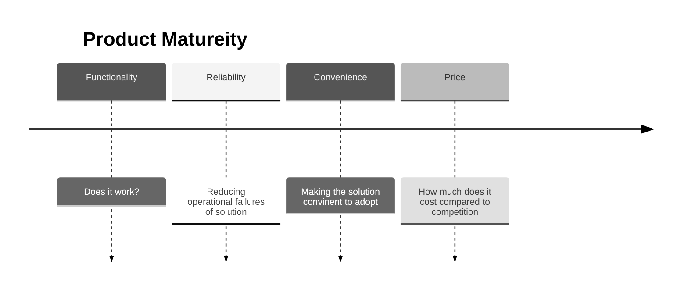
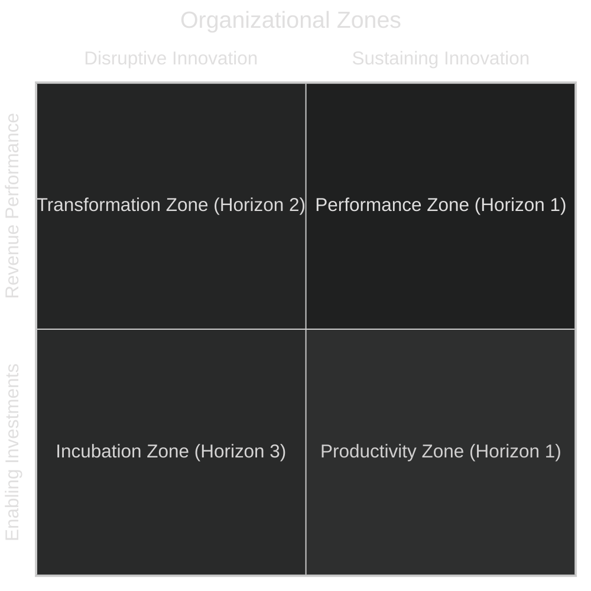

There are books that many companies in Silicon Valley use to build their corporate strategies or use to justify their culture. This sumarizes one popular set of books, from an engineering point of view, focusing on the strategy bits. It is easy to find flaws in the arguments of these books and cases where they don't apply at all. That said, the point of these books are not to be perfect predictive models in the way one thinks about science and engineering. Rather, using them to understand why a company is behaving in a particular way so you can do something about it, is arguably more useful. The intent is to help diagnose pathologies and communicate more effectively with business leaders.

## Setting the Stage

There are four books being reviewed: 'Crossing the Chasm', 'The Innovators Dilema', 'Escape Velocity', and 'Zone to Win'. _It should be noted that all books except 'The Innovators Dilema' focus on B2B companies specifically._ These books ask two core questions:

* What are the mechanisms by which innovations succeed becoming defaults or monopolizing a market long-term?
* Why do already successful companies often fail when trying to land new disruptive innovations?

## Pits of Uncertainty

Both questions are answered throughout each book, with different contexts. Starting with the first question it seems logical to start with 'Crossing the Chasm'. The book primarily focuses on the marketing and sales aspects of a business. The phrase, _crossing the chasm_, refers to marketing gaps or _chasms_ in the lifecycle of technical products during the different stages of maturity. It's usually visualized as a bell curve with gaps at each standard deviation to the left and right, where the area under the curve represents market adoption. My graphic is different because the information being conveyed in that form makes it look scientific or like statistics are being conducted with _data_.

The _innovators_ are defined as the group of people that dig into the details. This book is overly generic in defining who these people are, using stereotypes, but it describes this group as people that sweat details and care more about new technology being a viable solution or step forward more than anything else. These _people_ tend to want _the technology at cost or without charge_ but in return they'll offer you invaluable insight that can help define what markets should be targeted or what the product direction should be focused on.

The next group are the _early adopters_ called _visionaries_. This group usually cares about high-risk and high-reward bets. They are characterized as hard to work with, but defining an MVP and target market is even harder without them. Given that this group is taking high-risk bets, the potential to go down the wrong path following them is higher.

The _early majority_ group, called _pragmatists_, are defined as wanting to build lasting and sustaining value over the long term. This is the most difficult chasm to cross into because:
> people will only purchase when they can reference other major players using this to hedge their risk.
The difficulty is the chicken and egg paradox, in order to get _major players_ you need _major players_.

The next group being the _late majority_, called _conservatives_, are described as people that don't want to deal with changes unless it's as easy as possible, and potentially forced.

The last group, _laggards_ or _skeptics_, are the people that want nothing to do with technological change. They perceive changes as needless risk where the consequences of change are unknown.

To cross the largest chasm, target a niche market and dominate it. The name of the game is organic growth by spreading through word of mouth by being too good to give up in a particular market that will make it a default offering, eventually becoming a default choice in adjacent markets one by one.

To market properly means determining the _positioning_ of the product: what makes it stand out and uniquely different. Making claims, or elevator pitches, are also different depending on what market stage the business is in. The core take away is that this really requires the entire company to be on board with the goal of crossing the chasm of the early adopters -> early majority. The _post-chasm_ phase occuring after describes a new set of challenges to overcome in order to be a viable company. There is now a people problem, the visionaries are people that don't want to focus on stabilization efforts and the pragmatists don't want to take needless unproven risks. The former were vital to building the company into what it has become but might not be helpful in taking the company forward so there is now a talent problem. Do you hire people, fire people, try to motivate people into new tasks and goals? It's quite possible that it requires some combination of all the above. What initially attracted a certain type of person might no longer be valid and its worth acknowledging that and creating a humane plan for it in advance (assuming you're a leader in that position).

## Malestroms

How do large and successful businesses capitalize on the innovation of disruptive technologies? The _Innovator's Dilemma_ is the book that breaks down the first core problem mentioned at the beginning, defining how businesses fail to adapt. This is my favorite book of the four because it's backed up by real data instead of lived experience and describes the mechanisms by which failures occur while not prescribing over-arching solutions.

### Understanding the Problem

Better management or being more technically innovative with respect to disruptive technologies, does not solve the problem. Instead, the same things that make a company successful to begin with also make it static because focusing attention on current customers means less time to pay attention to new markets and new customer segments created by changes to technologies. The capabilities, organizational structures, and decision making processes that make the current company successful should not be discarded, but the fact that they exist makes it hard to create new ones to manage new products and technologies, potentially in new markets.

Products that don't appear useful today could be highly relevant tomorrow. Being customer focused is a draw back while exploring new possibilities especially in markets that don't exist yet. This means that organizations are more likely to starve innovative solutions of resources before they reach a critical mass. The value networks of a company is a big factor in resource allocation but it can be used both as a benefit multiplier or a drawback when networks need to be created.

Disruptive technologies should be seen as marketing challenges rather than engineering ones. This is because they open up new markets or market segments rather than fitting into the existing market of a _sustaining technology_: the technology that makes the business successful.

_Capabilities_ are usually highly specialized and context specific because they're created in _value networks_, which means they are tied to fixed markets and those same value networks disable them from other markets.

Finding or innovating a disruptive techology is high risk, meaning that there is potential for high costs. It's possible to get lucky but lowering the cost is better, if possible. The goal to innovating a disruptive technology is to make sure there is enough budget to try, fail, and iterate. Leaving room for iteration is key because if a new potential market is found then time and money to invest into it is needed, all while keeping afloat the current business.

Deciding when to be a leader or follower, with respect to a disruptive technology, is also context specific. Different postures are needed for both _sustaining_ and _disruptive_ technologies. Disruptive technologies often have distinct first mover advantages but sustaining ones do not. Both incremental updates to technology vs giant leaps forward historically perform about as well. New technologies have powerful barriers to entry. They are different than ones economists normally measure and experience, because they don't map to existing models well, it is hard to know what type will be successful.

### Discord and Navigational Gudiance

The principles of disruptive technologies are described by the following:

- companies depend on customers and investors to survive
  - high performing companies have good systems for killing ideas that customers don't want
- small markets don't solve the growth needs of large companies
  - successful companies need to grow which makes small markets undesirable both internally and externally
    - internally, employees want to find ways to make larger impact to find promotions for performance evaluations, as a driving incentive
    - externally, share holders want stock value to go up exacerbating the need for short term gains opposed to sustainable business practices
- markets that don't exist can't be analyzed
  - if the data doesn't exist then how is it possible to persuade anyone on taking the risk and allocating resources to a project?
- supply may not meet demand
  - pace of technological progress is ahead of market needs

Characteristics of disruptive technologies are that they tend to be cheaper, lower performing, and simpler; generally having lower profits and margins and target emerging markets. There is a tendency to always move up market targeting higher profits and yields, people get greedy rather than sustain the thing they have. When investing in new technologies and making bets, assume that they'll be wrong. This is mostly a game of statistics, all it takes is one good bet to makeup for the loss of the others. Disruptive technologies often capitalize on things that existing customers don't need or want, therefore generating a new market and removing barriers and competition, until those markets **become** the main market. A product's maturity usually progresses in the following order:

Mapping how many times this has happened or where a product is along this trajectory could be an indicator for how important new investments might be. Senior executives are usually enslaved to the ideas that middle management bring up. Encouraging employees to be disruptive and having a system that caters for difference helps. Can corps. redesign the organization structures to better suite disruptive innovation and account for it? This is an open question since it could be company, market, or industry specific. How do you decide when an idea is worth pursuing? Often well managed companies fail because they are well managed by current standards. What can be done to see that these norms get adjusted to account for dynamism over time, is the closing thought.

## Answering the Innovator

_Escape Velocity_, provides a theoretical foundation for the open questions posed in _Innovator's Dilema_ -- how can an existing successful company be structured in a way that can take advantage of disruptive techologies?

They describe two strategies, outside-in and inside-out, as essential to executing innovative ideas. The former focuses on outsider perspectives to market trends and the latter is the view of vision and strategy from within. The _hierarchy of powers_ provides a map to address the difference between vision and strategy, so:
> the right questions, get the right answers, at the right time, in the right sequence.

The heirarchy of powers begins with _category power_, a function of demand for a given class of products relative to others. Entering new categories is essential to transforming a company. As he likes to state, "last year's plan always favors the current portfolio." Next is _company power_, it reflects the status and prospects of a specific vendor relative to its competitive set. These can be different for each category the company operates in but the sum-total of all categories is the company power. Asymmetrical bets are hard to get right but are necessary to remain competitive. _Market power_ follows and is the same as company power but within a single market segment. Being a market leader is a sustainable competitive advantage. Market tipping points are real, they suggests getting a dollar in a new market is better than one coming from anywhere else because demand in a segment leads to more demand. _Offer power_ is a function of demand for a product relative to its competitors. How many people want to buy the product in comparison to similar products. This can change over time when products get commoditized, which means innovating is mandatory to survive. Lastly, _execution power_ is the ability to outperform competitors. Executing traditionally can be part of the problem to innovation. Innovate to achieve competitive separation. Institutionalize the activities that underlie the separation then drive the transition from innovation to deployment. Each power are described as a _vector_, things with magnitude and direction. When they're misaligned forward progress can cancel each other out while alignment is synergistic.

Category power is the number one predictor of future progress. The category maturity model and lifecycle has five states:
1. Emerging categories: high risk and high reward which is great for startups and bad for existing companies
2. Growth categories: people getting rich through user growth via land grabs
3. Mature categories: low risk and can innovate through optimization successfully
4. Declining categories: still valuable but will die, divest here
5. End of life

Three time horizons are described as placese to focus bets and strategies. Horizon one (H1) is for resource plans expected to turn a profit within a year or two. Horizon two (H2) is for the technical setup and foundations for success of new products or technologies. Horizon three (H3) is for visionary leaps. H2 efforts are the ones that matter most but are the least likely to be invested in because they contain the most uncertainty and impact real resources; H3 has a potential stake in future resources, rather than current ones. H2 is focused one  the execution of independent but vertically integrated businesses.

Two types of business strategies in technology are described, the first being a complex systems offering, the second is based on moving volume of the product or service. In other words, create a complex system that others can benefit from by operating it with ease, or sell a service or product that's good and do it a lot.

The book describes a playbook for utilizing its reported findings:
- Find growth categories by making asymmetrical bets and temporary rapid investments in emergent H3 categories then promote them to H2 and it'll be possible to create secular growth.
- Creating asymmetrical bets by developing and fostering core differentiation will build company power. Establish the vision, strategy, and leadership required to gain traction and distance yourself from competitors in target markets.
- Establish _market power_ by finding markets in transition (markets that are in need of a solution or ready for disruption). Create partnerships with leaders, companies in target market, and subject matter experts, then focus on building a _whole offer_ founded on your _crown jewels_ with the intent dominating a market subcategory by creating value no one else can compete with.
- Create critical differentiators in your product by leveraging core capabilities in an effort to make them unique.
- Execution dynamics:
  - Playbooks are preconfigured solution-kits that are tailored to customer requirements. The solutions are not _custom_ but _customized_. _Projects_ are basically installs that are entirely custom each time, which is far from ideal.
  - Complex systems: these businesses can be optimized highly in order to grow so that they can keep selling solutions at scale or shift business strategies to volume based once commoditized.
  - Invention, deployment, and optimization are seen as three phases in a product or company lifecycle where management in one phase is usually sub-optimal for the others. Innovation phase type organization design should be fully integrated, but that doesn't scale into deployment. The deployment phase has separate functions where sales, marketing, and engineering all report to separate people. The optimization phase attempts to create an organization that removes redundancy and increases resilience through things like additional review. It's a good thing towards a product's end of life.
  - Create local centers of excellence: this is for each product phase.
  - Catalytic programs are designed for executives, they basically transparently post overall status on core objectives as a way to maintain control and alignment of vision.
  - Knowledge management is an issue everywhere; making communication flow seamlessly and getting to a just-in-time information model is the ideal.

## Executing the Strategy

_Zone to Win_, is a _playbook_ for _Escape Velocity_, which is primarily its theoretical counterpart. The idea being the way an organization is structured has a big impact on its long-term success and this describes in detail, a specific strategy for long-term success in large organizations. When an organization is structured entirely around its core competencies and business, there will be a _crises of prioritization_, where all the resources are at competition with different initiatives.

Four zones are described:

This organizing structure for an organization makes it easy to logically separate resources for different projects. The _transformation zone_ may not always exist because only a single successful transformation is required to sustain a business for a decade. The other three are always required however. There is a concept of _defense_ and _offense_ where the former is used in times of emergency, basically trying to take new technology in development from the _incubation zone_ and put it into the _performance zone_; the latter is all about getting a new competing technology out to market first.

The _performance zone_ is all about sales and everything that drives revenue. Building a performance matrix will show what the cost centers are and in times of stability rather than disruption, these can be optimized to hit max revenue targets.

For people in business speak, the _productivity zone_ is seen as everything that doesn't drive revenue and are considered _cost centers_. This is why you are measured as a line item in a spreadsheet. The performance zone handles the top line making the number increase from a sales perspective while the _productivity zone_ drives the bottom line. Areas to focus on in order to reduce cost to increase the bottom line of what already exists.

The _incubation zone_ is basically a bunch of projects that are not particularly R&D but are more like separate product bets, which may include some R&D. These should be filled with people trying to find ways to grow the company but the chances you have to incubate something are finite. Anything that shows strong potential in this category moves to the _transformation zone_.

The _transformation zone_ is a graduated _incubation zone_ project. The time horizon on this is shorter and the idea is to focus the entire executive staff on turning this into the core offerings available to all to hit new markets and drive non-linear growth. This is hard because it requires deep focus and alignment from the entire company to do right, as well as sacrifices from the performance zone by replacing some columns of the performance matrix with the new product undergoing transformation which will perform worse for the foreseeable future.

Horizon zero (H0) is used to describe products or services that should hit an end-of-life target. This should be handled by different leadership than the current staff in charge of running the targeted service because there is too much potential for conflicts of interest. H0 is used as a strategy to free up resources and allocate them to a transformation effort. This might be people, or it might be systems. If it's people, they'll either be shifted around or fired. This is one reason for a _reduction in force_.

Zone management is basically giving each org a designated zone. Each organization can only be part of a single zone because they must deliver on the zone's contract. Each org is judged on its performance in their zone designation.

While the _incubation_ zone has a finite amount of incubated projects, the transformation zone can only have a single project in that phase at a time. This puts pressure in a lot of places requiring every person to be aligned to make it work; this is core to the strategy. The other call out is that while in _offense_ mode you have time to be the disruptor and make a new market, but in _defense_ mode where you're basically trying to pull a project from the incubator zone into the transformation zone and slap it into the main offerings as a kludge, you can only be in one of these two states. It's unlikely to work in your favor to play offense and defense at the same time just as it is not ideal to work on two main objectives at the same time.

## Criticisms

_Crossing the Chasm_ assumes that markets are not interdependent entites but live in isolation. The book uses many stereotypes and assumptions making conclusions based on story rather than evidence, in fact this is true of all of _Geoffry Moore's works. They use hand picked stories from lived experience as opposed to something like a _systematic review_ of technology companies. Instead of treating markets like hostile takeovers and warfare, it could focus on satisfying the niche needs of users and expanding without appealing to violent metaphors. It is possible to build a company that respects others in the same market and still be the main player of a segment. It is also true that other people will be playing zero-sum games, so these books do provide the mental framework for how others may be looking at you. The assumptions still make a compelling case and this data was gathered through years of lived experience by the author, it'd be wrong to wave it away, but also don't treat it like a perfect predictive model. Both _Escape Velocity_ and _Zone to Win_ reference other books written by the author and stated as fact which is pretty hard to swallow. More description should be given when defining terms.

While I find _The Innovator's Dilema_ the most compelling read, it is ultimately looking at a subset of technology companies from the past in order to provide some context about future performance and indicators for company distress in the future. The problem is that markets change significantly, as do their operating conditions. These books are far from perfect, but I do think they provide some useful insights as long as you don't take a puritanical view and hold them up as _the truth_. Like everything else in life, context of a situation matters a lot more than prescriptive models that don't touch it.
