As I build up to implementing lock-free data structures, I am documenting my journey and understanding of how various mechanics work in an unfiltered way. You will encounter flaws in the design, my thoughts, and the misuse of some tools that I learned along the way; they're included intentionally so that people interested in the debugging process have an example demonstrating how understanding of unfamiliar concepts evolves over the course of a project. AI was not used in writing this post, so yeah, it might read poorly. AI was not used in writing this code, because it would defeat the purpose of understanding it. Also, sometimes code is linked to github and other times it's directly on the blog, I generally try to be consistent but laziness happens; apologies.

# Implementing a High Performance Thread Safe Ring Buffer

When testing the [ring buffer](https://github.com/k-cross/limitless/commit/b0f8f05d8a620b6f25da037f43a7f559846bced9) in a _multi-producer multi-consumer_ setup, I run into some issues. There are a total of 12 threads running on my test machine which is equal to the number of logical cores on it. In this particular _failure_ the test never ends and it's unclear why. The read and write thread ratio is $1:1$---all _write_ threads exit but none of the _read_ threads do.
```plaintext
cargo test -- --nocapture

   Compiling limitless v0.1.0 (/Users/ken/src/limitless)
    Finished `test` profile [unoptimized + debuginfo] target(s) in 0.14s
     Running unittests src/lib.rs (target/debug/deps/limitless-81300e65d0a06de1)

running 2 tests
running 12 threads
test tests::test_single_threaded ... ok
write enter
read enter
write enter
read enter
read enter
read enter
write enter
read enter
read enter
write enter
write enter
write enter
write exit
write exit
write exit
write exit
write exit
write exit
```
At first, I thought maybe there was a livelock situation happening. Just so we're operating on the same context, the naive ring buffer implementation looks like the following:
```rust
pub struct RingBuffer<T, const N: usize> {
    buffer: Box<[UnsafeCell<MaybeUninit<T>>; N]>,
    capacity: usize,
    size: AtomicUsize,
    read_idx: AtomicUsize,
    write_idx: AtomicUsize,
}
```
The current read implementation looks like:
```rust
    pub fn read(&self) -> Result<T, ()> {
        let rr: T;
        loop {
            if self.is_empty() {
                return Err(());
            }
            let idx = self.read_idx.load(Ordering::Acquire);
            let r = self.buffer[idx].get();
            if let Err(_) = self.read_idx.compare_exchange_weak(
                idx,
                (idx + 1) % self.capacity,
                Ordering::AcqRel,
                Ordering::Relaxed,
            ) {
                continue;
            };
            self.size.fetch_sub(1, Ordering::AcqRel);
            rr = unsafe { r.read().assume_init() };
            break;
        }
        Ok(rr)
    }
```
Here's another run; this time all 5 of the 6 _reads_ exit... why?
```plaintext
 cargo test -- --nocapture

    Finished `test` profile [unoptimized + debuginfo] target(s) in 0.00s
     Running unittests src/lib.rs (target/debug/deps/limitless-81300e65d0a06de1)

running 2 tests
running 12 threads
test tests::test_single_threaded ... ok
write enter
write enter
read enter
write enter
read enter
write enter
write enter
read enter
read enter
read enter
read enter
write enter
write exit
write exit
write exit
write exit
write exit
write exit
read exit
read exit
read exit
read exit
read exit
```

LLDB output from a test with a result like above:
```lldb
(lldb)
thread list Process 6838 stopped * thread #1: tid = 0x6d1d86, 0x000000018f151af8 libsystem_kernel.dylib`__ulock_wait + 8, name = 'main' ,queue = 'com.apple.main-thread', stop reason = signal SIGSTOP

thread #2: tid = 0x6d1d97, 0x0000000100002078 limitless`core::sync::atomic::atomic_compare_exchange_weak::hc90ca5493e55142c(dst=0x00000001006d9e68, old=13659, new=13660, success=AcqRel, failure=Relaxed) at
atomic.rs:4058:17

thread #3: tid = 0x6d1d99, 0x0000000100002078 limitless`core::sync::atomic::atomic_compare_exchange_weak::hc90ca5493e55142c(dst=0x00000001006d9e68, old=13660, new=13661, success=AcqRel, failure=Relaxed) at atomic.rs:4058:17

thread #4: tid = 0x6d1d9b, 0x0000000100001728 limitless`core::sync::atomic::atomic_load::h819f9946b684b71f(dst=0x00000001006d9e60, order=Acquire) at
atomic.rs:3891:24

thread #5: tid = 0x6d1d9d, 0x0000000100003220 limitless`core::sync::atomic::atomic_add::hc01f4ad76202be91(dst=0x0000000c23000950, val=1, order=SeqCst) at atomic.rs:3927:23

thread #6: tid = 0x6d1d9f, 0x0000000100001770 limitless`core::sync::atomic::atomic_load::h819f9946b684b71f(dst=0x00000001006d9e60, order=Acquire) at
atomic.rs:3897:2
```

All active threads appear to be stopped in atomic operations. Digging in further:
```lldb
(lldb) bt all
...
  thread #4
    frame #0: 0x0000000100001728 limitless`core::sync::atomic::atomic_load::h819f9946b684b71f(dst=0x00000001006d9e60, order=Acquire) at atomic.rs:3891:24
    frame #1: 0x0000000100003154 limitless`core::sync::atomic::AtomicUsize::load::h713bcebdb3e513d6(self=0x00000001006d9e60, order=Acquire) at atomic.rs:2844:26
    frame #2: 0x0000000100009848 limitless`limitless::RingBuffer$LT$T$C$_$GT$::is_empty::h03b9730d09c7598d(self=0x00000001006d9e50) at lib.rs:38:19
    frame #3: 0x00000001000036c0 limitless`limitless::main::_$u7b$$u7b$closure$u7d$$u7d$::hc111c428cb62f9ae at main.rs:42:28
    frame #4: 0x00000001000023ac limitless`std::sys::backtrace::__rust_begin_short_backtrace::h3d82a3a15fa2662e(f={closure_env#1} @ 0x0000000170e5ab88) at backtrace.rs:166:18
    frame #5: 0x0000000100008970 limitless`std::thread::lifecycle::spawn_unchecked::_$u7b$$u7b$closure$u7d$$u7d$::_$u7b$$u7b$closure$u7d$$u7d$::h6cb6020931fd9857 at lifecycle.rs:91:13
    frame #6: 0x0000000100003f68 limitless`_$LT$core..panic..unwind_safe..AssertUnwindSafe$LT$F$GT$$u20$as$u20$core..ops..function..FnOnce$LT$$LP$$RP$$GT$$GT$::call_once::hbca44f90cd657544(self=<unavailable>, (null)=<unavailable>) at unwind_safe.rs:274:9
    frame #7: 0x00000001000025e0 limitless`std::panicking::catch_unwind::do_call::h6bd49b303a779f6b(data="") at panicking.rs:581:40
    frame #8: 0x0000000100008ddc limitless`__rust_try + 32
    frame #9: 0x00000001000086c4 limitless`std::panicking::catch_unwind::h679bc473c2cb13fc(f=AssertUnwindSafe<std::thread::lifecycle::spawn_unchecked::{closure#1}::{closure_env#0}<limitless::main::{closure_env#1}, ()>> @ 0x0000000170e5ad40) at panicking.rs:544:19
    frame #10: 0x0000000100008678 limitless`std::panic::catch_unwind::h7fd030632dd01f5c(f=AssertUnwindSafe<std::thread::lifecycle::spawn_unchecked::{closure#1}::{closure_env#0}<limitless::main::{closure_env#1}, ()>> @ 0x0000000170e5ad40) at panic.rs:359:14 [inlined]
    frame #11: 0x0000000100008678 limitless`std::thread::lifecycle::spawn_unchecked::_$u7b$$u7b$closure$u7d$$u7d$::he5df325236d75f0e at lifecycle.rs:89:26
    frame #12: 0x0000000100005390 limitless`core::ops::function::FnOnce::call_once$u7b$$u7b$vtable.shim$u7d$$u7d$::hbc10a7c24da16b0b((null)=0x00000001006dacd0, (null)=<unavailable>) at function.rs:250:5
    frame #13: 0x0000000100029bc8 limitless`<alloc::boxed::Box<dyn core::ops::function::FnOnce<(), Output = ()> + core::marker::Send> as core::ops::function::FnOnce<()>>::call_once at boxed.rs:2240:9 [opt] [inlined]
    frame #14: 0x0000000100029bbc limitless`<std::sys::thread::unix::Thread>::new::thread_start at unix.rs:118:17 [opt]
    frame #15: 0x000000018f193c58 libsystem_pthread.dylib`_pthread_start + 136
  thread #5
  ...
  thread #6
    frame #0: 0x0000000100001770 limitless`core::sync::atomic::atomic_load::h819f9946b684b71f(dst=0x00000001006d9e60, order=Acquire) at atomic.rs:3897:2
    frame #1: 0x0000000100003154 limitless`core::sync::atomic::AtomicUsize::load::h713bcebdb3e513d6(self=0x00000001006d9e60, order=Acquire) at atomic.rs:2844:26
    frame #2: 0x0000000100009848 limitless`limitless::RingBuffer$LT$T$C$_$GT$::is_empty::h03b9730d09c7598d(self=0x00000001006d9e50) at lib.rs:38:19
    frame #3: 0x0000000100009414 limitless`limitless::RingBuffer$LT$T$C$_$GT$::read::h408dd2361ad102b4(self=0x00000001006d9e50) at lib.rs:44:21
    frame #4: 0x000000010000370c limitless`limitless::main::_$u7b$$u7b$closure$u7d$$u7d$::hc111c428cb62f9ae at main.rs:43:40
    frame #5: 0x00000001000023ac limitless`std::sys::backtrace::__rust_begin_short_backtrace::h3d82a3a15fa2662e(f={closure_env#1} @ 0x000000017168ab88) at backtrace.rs:166:18
    frame #6: 0x0000000100008970 limitless`std::thread::lifecycle::spawn_unchecked::_$u7b$$u7b$closure$u7d$$u7d$::_$u7b$$u7b$closure$u7d$$u7d$::h6cb6020931fd9857 at lifecycle.rs:91:13
    frame #7: 0x0000000100003f68 limitless`_$LT$core..panic..unwind_safe..AssertUnwindSafe$LT$F$GT$$u20$as$u20$core..ops..function..FnOnce$LT$$LP$$RP$$GT$$GT$::call_once::hbca44f90cd657544(self=<unavailable>, (null)=<unavailable>) at unwind_safe.rs:274:9
    frame #8: 0x00000001000025e0 limitless`std::panicking::catch_unwind::do_call::h6bd49b303a779f6b(data="") at panicking.rs:581:40
    frame #9: 0x0000000100008ddc limitless`__rust_try + 32
    frame #10: 0x00000001000086c4 limitless`std::panicking::catch_unwind::h679bc473c2cb13fc(f=AssertUnwindSafe<std::thread::lifecycle::spawn_unchecked::{closure#1}::{closure_env#0}<limitless::main::{closure_env#1}, ()>> @ 0x000000017168ad40) at panicking.rs:544:19
    frame #11: 0x0000000100008678 limitless`std::panic::catch_unwind::h7fd030632dd01f5c(f=AssertUnwindSafe<std::thread::lifecycle::spawn_unchecked::{closure#1}::{closure_env#0}<limitless::main::{closure_env#1}, ()>> @ 0x000000017168ad40) at panic.rs:359:14 [inlined]
    frame #12: 0x0000000100008678 limitless`std::thread::lifecycle::spawn_unchecked::_$u7b$$u7b$closure$u7d$$u7d$::he5df325236d75f0e at lifecycle.rs:89:26
    frame #13: 0x0000000100005390 limitless`core::ops::function::FnOnce::call_once$u7b$$u7b$vtable.shim$u7d$$u7d$::hbc10a7c24da16b0b((null)=0x00000001006db9d0, (null)=<unavailable>) at function.rs:250:5
    frame #14: 0x0000000100029bc8 limitless`<alloc::boxed::Box<dyn core::ops::function::FnOnce<(), Output = ()> + core::marker::Send> as core::ops::function::FnOnce<()>>::call_once at boxed.rs:2240:9 [opt] [inlined]
    frame #15: 0x0000000100029bbc limitless`<std::sys::thread::unix::Thread>::new::thread_start at unix.rs:118:17 [opt]
    frame #16: 0x000000018f193c58 libsystem_pthread.dylib`_pthread_start + 136
```
It appears both thread 4 and 6 are checking whether or not the ring buffer is empty. This is the current implementation; is it wrong? (Truncating output because it's quite large)
```rust
    pub fn is_empty(&self) -> bool {
        self.size.load(Ordering::Acquire) == 0
    }
```
Let's try to inspect the ring buffer:
```lldb
(lldb) p rbc
(alloc::sync::Arc<limitless::RingBuffer<unsigned long>, alloc::alloc::Global>) strong=6, weak=0 {
  data = {
    buffer = 0x0000000c22800000
    capacity = 16384
    size = {
      v = {
        value = 18446744073687878303
      }
    }
    read_idx = {
      v = {
        value = 13667
      }
    }
    write_idx = {
      v = {
        value = 0
      }
    }
  }
}
```
Okay, this is interesting... `size` should never be larger than `capacity`, so it looks like we're running into some ordering issues when working with `size` while incrementing or decrementing. Is this number close to the largest number on MacOS for `usize`?
$$
usize_{max} = 18{,}446{,}744{,}073{,}709{,}551{,}615
$$
Okay, so this is probably the line doing the `fetch_sub` and the atomic is wrapping around when it's already at zero... how can this occur? The write implementation might have a conflict in timing with the read because a write thread could in theory pause when data is being written, but the index is still bumped forward... however, my test just inserts all ones so it's not going to really indicate data overwrite well.
```rust
    pub fn write(&self, v: T) -> Result<(), ()> {
        loop {
            if self.is_full() {
                return Err(());
            }
            let idx = self.write_idx.load(Ordering::Acquire);
            if let Err(_) = self.write_idx.compare_exchange_weak(
                idx,
                (idx + 1) % self.capacity,
                Ordering::AcqRel,
                Ordering::Relaxed,
            ) {
                // Note: maybe need to add jitter/backoff here
                continue;
            };
            // Note: maybe need to do a drop(old_ptr), need to verify memory doesn't leak
            unsafe { self.buffer[idx].get().write(MaybeUninit::new(v)) };
            self.size.fetch_add(1, Ordering::SeqCst);
            break;
        }
        Ok(())
    }
}
```

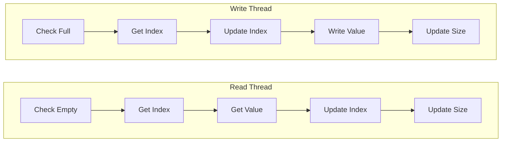
The problem is a simple race condition... `full` and `empty` are calculated by `size`, but `size` is updated at the end of a function. This check should probably not be dependent on a `size` variable, but rather calculated from existing indices. How can I get the `read_idx` and the `write_idx` to uniquely calculate whether it's full or empty?

After looking at some other implementations, it appears two are common:
1. waste a slot so empty is $head = tail$ and full is $(tail + 1) \bmod capacity = head$
2. double the size of the array
	1. $(tail - head) \geq capacity$ is the general idea but adds complexity due to cycles/laps

The first implementation wastes less memory and is a bit simpler; I will update to reflect that approach.
```rust
    pub fn is_full(&self) -> bool {
        (self.write_idx.load(Ordering::Acquire) + 1) % self.capacity
            == self.read_idx.load(Ordering::Acquire)
    }

    pub fn is_empty(&self) -> bool {
        self.write_idx.load(Ordering::Acquire) == self.read_idx.load(Ordering::Acquire)
    }
```
Okay, this fixed the race condition. The next issue seems to be a memory ordering issue. Every value in the array should equal $1$, but instead, there will be random values occasionally which mess with the calculation. Is it possible another race condition occurs where we don't finish writing, but we read an uninitialized value? Yes... this is an interesting problem, though. If I write the value before updating the index, then it's possible another write will overwrite the same index but if I update the index before writing a value, it's possible a reader reads from it before it's ready... after reading a value, is there a way to indicate that it's been read? Also, is there a way to indicate no value has yet been written for the first time? Tracking initialized memory via a data structure looks like the approach people take here. Here are two options for multi-reader/writer access:
1. create a struct manually tracking the initialization state and the value together
2. create an array that bitmaps the initialization state of the array by certain values
	1. an array of `u64` for instance, could contain the initialization state of the first $64$ values in the bitmaps first index. So the number of indices required for the bitmap would be the $bitmapIndices = \frac{capacity}{byteSize}$
It's not much more effort to calculate via bitmaps, but is it faster computationally to just store it next to the data access? Every read and write needs to flip the initialization...

After implementing option 1 [here](https://github.com/k-cross/limitless/commit/86b99e41b7612790f1616159fa89120ea115ce24), the write threads seem to have a problem now... What's the issue?
```plaintext
loop 32
running 12 threads
write enter
read enter
write enter
read enter
write enter
read enter
write enter
write enter
write enter
read enter
read enter
read enter
read exit
read exit
read exit
read exit
read exit
read exit
```
```lldb
(lldb) thread list
Process 17878 stopped
* thread #1: tid = 0x78f6d6, 0x000000018f151af8 libsystem_kernel.dylib`__ulock_wait + 8, name = 'main', queue = 'com.apple.main-thread', stop reason = signal SIGSTOP
  thread #2: tid = 0x78f876, 0x0000000102ae1e8c limitless`limitless::RingBuffer$LT$T$C$_$GT$::is_full::h5703e81dc7718dcd(self=0x0000000a03404010) at lib.rs:38:56
  thread #3: tid = 0x78f878, 0x0000000102ad97d4 limitless`core::sync::atomic::atomic_load::h819f9946b684b71f(dst=0x0000000a03404020, order=Acquire) at atomic.rs:0:9
  thread #4: tid = 0x78f87a, 0x0000000102ae1bc8 limitless`limitless::RingBuffer$LT$T$C$_$GT$::write::hd4a98e974653f01c(self=0x0000000a03404010, v=1) at lib.rs:0:16
  thread #5: tid = 0x78f87c, 0x0000000102ad96c0 limitless`core::sync::atomic::atomic_load::h722d6c5e51cabb9c(dst="\U00000001", order=Acquire) at atomic.rs:3889:15
  thread #6: tid = 0x78f87e, 0x0000000102ae1b7c limitless`limitless::RingBuffer$LT$T$C$_$GT$::write::hd4a98e974653f01c(self=0x0000000a03404010, v=1) at lib.rs:78:23
  thread #7: tid = 0x78f880, 0x0000000102ad9884 limitless`core::sync::atomic::atomic_load::h819f9946b684b71f(dst=0x0000000a03404020, order=Acquire) at atomic.rs:3897:2
```
Maybe this is an issue with the test program? No, write errors are tracked through an independent counter and `is_full` is a handled case. Let's look at all the back traces from all the threads.
```lldb
(lldb) bt all
* thread #1, name = 'main', queue = 'com.apple.main-thread', stop reason = signal SIGSTOP
  ...
  thread #2
    frame #0: 0x0000000102ae1e8c limitless`limitless::RingBuffer$LT$T$C$_$GT$::is_full::h5703e81dc7718dcd(self=0x0000000a03404010) at lib.rs:38:56
    frame #1: 0x0000000102ae1b24 limitless`limitless::RingBuffer$LT$T$C$_$GT$::write::hd4a98e974653f01c(self=0x0000000a03404010, v=1) at lib.rs:75:21
    frame #2: 0x0000000102adb79c limitless`limitless::main::_$u7b$$u7b$closure$u7d$$u7d$::h3f38ca611c351d15 at main.rs:34:45
    ...
  thread #3
    frame #0: 0x0000000102ad97d4 limitless`core::sync::atomic::atomic_load::h819f9946b684b71f(dst=0x0000000a03404020, order=Acquire) at atomic.rs:0:9
    frame #1: 0x0000000102adb3e8 limitless`core::sync::atomic::AtomicUsize::load::h713bcebdb3e513d6(self=0x0000000a03404020, order=Acquire) at atomic.rs:2844:26
    frame #2: 0x0000000102ae1ecc limitless`limitless::RingBuffer$LT$T$C$_$GT$::is_full::h5703e81dc7718dcd(self=0x0000000a03404010) at lib.rs:39:30
    frame #3: 0x0000000102ae1b24 limitless`limitless::RingBuffer$LT$T$C$_$GT$::write::hd4a98e974653f01c(self=0x0000000a03404010, v=1) at lib.rs:75:21
    ...
  thread #4
    frame #0: 0x0000000102ae1bc8 limitless`limitless::RingBuffer$LT$T$C$_$GT$::write::hd4a98e974653f01c(self=0x0000000a03404010, v=1) at lib.rs:0:16
    frame #1: 0x0000000102adb79c limitless`limitless::main::_$u7b$$u7b$closure$u7d$$u7d$::h3f38ca611c351d15 at main.rs:34:45
    frame #2: 0x0000000102ada630 limitless`std::sys::backtrace::__rust_begin_short_backtrace::hd5c779292ce3750f(f={closure_env#0} @ 0x000000016dd5eb88) at backtrace.rs:166:18
    frame #3: 0x0000000102ae0cd0 limitless`std::thread::lifecycle::spawn_unchecked::_$u7b$$u7b$closure$u7d$$u7d$::_$u7b$$u7b$closure$u7d$$u7d$::hb2f9cb50ba78b778 at lifecycle.rs:91:13
    frame #4: 0x0000000102adc2e4 limitless`_$LT$core..panic..unwind_safe..AssertUnwindSafe$LT$F$GT$$u20$as$u20$core..ops..function..FnOnce$LT$$LP$$RP$$GT$$GT$::call_once::he32e61f1c6c310a9(self=<unavailable>, (null)=<unavailable>) at unwind_safe.rs:274:9
    frame #5: 0x0000000102ada808 limitless`std::panicking::catch_unwind::do_call::hbd6dd15bde839ad0(data="") at panicking.rs:581:40
    ...
  thread #5
    frame #0: 0x0000000102ad96c0 limitless`core::sync::atomic::atomic_load::h722d6c5e51cabb9c(dst="\U00000001", order=Acquire) at atomic.rs:3889:15
    frame #1: 0x0000000102adb34c limitless`core::sync::atomic::AtomicBool::load::h727dfb3a132f3c5a(self=0x0000000a01807b98, order=Acquire) at atomic.rs:729:18
    frame #2: 0x0000000102ae1c0c limitless`limitless::RingBuffer$LT$T$C$_$GT$::write::hd4a98e974653f01c(self=0x0000000a03404010, v=1) at lib.rs:79:45
    frame #3: 0x0000000102adb79c limitless`limitless::main::_$u7b$$u7b$closure$u7d$$u7d$::h3f38ca611c351d15 at main.rs:34:45
    ...
  thread #6
    frame #0: 0x0000000102ae1b7c limitless`limitless::RingBuffer$LT$T$C$_$GT$::write::hd4a98e974653f01c(self=0x0000000a03404010, v=1) at lib.rs:78:23
    frame #1: 0x0000000102adb79c limitless`limitless::main::_$u7b$$u7b$closure$u7d$$u7d$::h3f38ca611c351d15 at main.rs:34:45
    frame #2: 0x0000000102ada630 limitless`std::sys::backtrace::__rust_begin_short_backtrace::hd5c779292ce3750f(f={closure_env#0} @ 0x000000016e58eb88) at backtrace.rs:166:18
    ...
  thread #7
    frame #0: 0x0000000102ad9884 limitless`core::sync::atomic::atomic_load::h819f9946b684b71f(dst=0x0000000a03404020, order=Acquire) at atomic.rs:3897:2
    frame #1: 0x0000000102adb3e8 limitless`core::sync::atomic::AtomicUsize::load::h713bcebdb3e513d6(self=0x0000000a03404020, order=Acquire) at atomic.rs:2844:26
    frame #2: 0x0000000102ae1ecc limitless`limitless::RingBuffer$LT$T$C$_$GT$::is_full::h5703e81dc7718dcd(self=0x0000000a03404010) at lib.rs:39:30
    frame #3: 0x0000000102ae1b24 limitless`limitless::RingBuffer$LT$T$C$_$GT$::write::hd4a98e974653f01c(self=0x0000000a03404010, v=1) at lib.rs:75:21
    ...
```
All 6 write threads are actively writing in main line 34. Next, let's check what the frame variables are stated as being in each of the write threads:

### Threads

```lldb
(lldb) frame variable
(alloc::sync::Arc<limitless::RingBuffer<unsigned long>, alloc::alloc::Global>) rbc = strong=7, weak=0 {
  data = {
    buffer = 0x0000000a01800000
    capacity = 16384
    read_idx = {
      v = {
        value = 1977
      }
    }
    write_idx = {
      v = {
        value = 1977
      }
    }
  }
}
(alloc::sync::Arc<core::sync::atomic::AtomicUsize, alloc::alloc::Global>) se = strong=7, weak=0 {
  data = {
    v = {
      value = 1070
    }
  }
}
(core::ops::range::Range<unsigned long>) iter = {
  start = 15359
  end = 16384
}
```
The only differences in each thread at this stage are the `start` and `end` ranges from local iterators, everything else is identical. It does show though, that `read_idx == write_idx` and there must be something happening at this particular state, which is `empty`. What does the object in the array at `0x0000000a01800000` look like? After some difficulty, the memory reading is:
```lldb
(lldb) memory read -c 16 -f x "((char*)rbc.ptr.pointer->data.buffer + (1977 * 16))"
0xa01807b90: 0x00000001 0x00000000 0x00000001 0x00000000
0xa01807ba0: 0x00000001 0x00000000 0x00000001 0x00000000
0xa01807bb0: 0x00000001 0x00000000 0x00000001 0x00000000
0xa01807bc0: 0x00000001 0x00000000 0x00000001 0x00000000
```
This is a little confusing and the value I chose to represent is perhaps not the best to work with but here we have the little-endian representation of the 16 bytes of memory assigned to a `Slot` where 8 bytes are for a `usize`, 1 byte is for a `bool`, and 7 bytes are padding. That reading suggests this contains:
```rust
Slot { initialization: true, data: 1 }
```
for each memory location.

Alright, so we've learned that all the memory locations are showing they're initialized, but they're supposed to be in the uninitialized state because a `read` should set them to uninitialized states. This would create a livelock because each write thread would be spinning waiting for memory to become uninitialized. Let's map out the new flow:
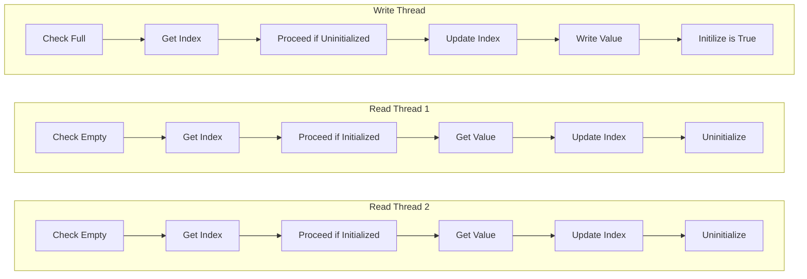
Maybe there's an issue with `is_full` and `is_empty` again. Could they race? Let's say we have an array with `[i, i, u, u, i]` and 2 write threads. If $wt_1 = wt_2 = \text{get index}$ and $wt_2$ yields, then $wt_1$ will finish and yield, setting the array to `[i,i,i,u,i]`, and $wt_2$ would eventually set this to `[i,i,i,i,i]`, making it appear full... The race condition is where the current `is_full` is checked... If I get the index first, check initialization, check empty/full, and then update the index, that would at least be more correct... I don't have to worry about reading a bad value now; I can check the init state.

There is still a race condition on these two lines but does it matter?
```rust
// in read
rr = unsafe { self.buffer[idx].data.get().read().assume_init() };
self.buffer[idx].initialized.store(false, Ordering::Release);

// in write
unsafe { self.buffer[idx].data.get().write(MaybeUninit::new(v)) };
self.buffer[idx].initialized.store(true, Ordering::Release);
```
There is a guaranteed unique index fully passed through to these two states, and they have been verified to be in the proper initialization state. Does a thread yielding in either of these impact others in earlier states? If the empty/full checks states with different indices, the later update index check will fail, which results in a `continue`. This should result in more contention but fewer errors.

Okay, new problem on reads... This time `lldb` is showing `Slot {data: 2, initialized: false}`  (I changed the data value in the test program to be 2). It's interesting that this seems to occur when `read_idx == write_idx == 0`. There are 5 exited `read` threads and no `write` threads. So now we are in a state where `read` is looping... Ahh, now the `uninitialization check` happens before we check empty, so it is in a continual loop that can never exit because there are no more writers. If the empty check is moved above the initialization check, is there a race?

Let's take a look at the data flow:
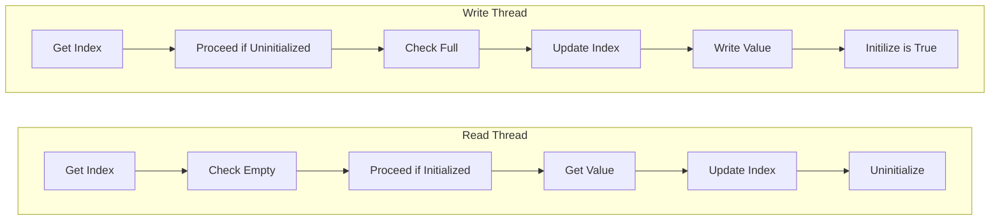
The check empty and full is in a different order in write vs read. For empirical data, there were no errors after:
```plaintext
result is 196608
loop 86125
running 12 threads
```
Let's reason about this for a bit because I suspect the same issue could happen to the write threads: all read threads exit and the ring buffer reads full, then two write threads can fight but one will win and the other will exit normally...

Okay, on the happy path this seems to work; now it's possible to start testing it with other mechanisms and failure scenarios. The first is probably to add another test to look at data corruption cases; the current test is good for race conditions, but everything in the array is initialized to $2$. Next, using loom[^1] to test thread interleaving in a more controlled way. Lastly, thinking about how to recover from a bad state in cases where a thread dies when the index is updated but no write happens, or a write happens but its state flag remains unchanged.
- data corruption
- thread interleaving
- recovering from failure

# Data Corruption
Memory does not leak. Watching data being allocated and removed does not affect the growth, at least not with `usize`, a copy type, so far. Next, I should test non-copy type value assignments.

First issue: trying to initialize this with a `struct` and using `std::array::from_fn` temporarily allocates data on the stack instead of directly on the heap, causing a stack overflow in the tests.
```sh
running 3 tests
test tests::test_single_threaded ... ok

thread 'tests::test_multi_threaded_independent_data_corruption_check' (9682249) has overflowed its stack
fatal runtime error: stack overflow, aborting
error: test failed, to rerun pass `--lib`
```

How the array is first initialized should be adjusted; I'll change it to use `map` and then `collect`. This is more elegant since it changes `RingBuffer<T, const N: usize>` to be more dynamically available at runtime. Now it's just `RingBuffer<T>` and `new(capacity: usize)` takes an argument instead. Okay, the new check tests for potential data overwrites and errors, and I think it's a reasonable verification of it.

# Thread Interleaving
Next up is using `loom` to have a controlled thread environment that manages its interleaving and allows for stronger verification; `loom` works based on this paper[^2].

### Side Quest
After a night's rest, I thought about other cases like the _ABA_ problem. Mapping out what this would look like in the current implementation of the RingBuffer:
```rust
#[derive(Debug)]
struct Slot<T> {
    data: UnsafeCell<MaybeUninit<T>>,
    initialized: AtomicBool,
}

#[derive(Debug)]
pub struct RingBuffer<T> {
    buffer: Box<[Slot<T>]>,
    capacity: usize,
    read_idx: AtomicUsize,
    write_idx: AtomicUsize,
}

impl<T> RingBuffer<T> {
    pub fn new(capacity: usize) -> Self {
        let buffer: Box<[Slot<T>]> = (0..capacity)
            .map(|_| Slot {
                data: UnsafeCell::new(MaybeUninit::uninit()),
                initialized: AtomicBool::new(false),
            })
            .collect();
        Self {
            buffer,
            capacity,
            read_idx: AtomicUsize::new(0),
            write_idx: AtomicUsize::new(0),
        }
    }

    pub fn is_full(&self) -> bool {
        (self.write_idx.load(Ordering::Acquire) + 1) % self.capacity
            == self.read_idx.load(Ordering::Acquire)
    }

    pub fn is_empty(&self) -> bool {
        self.write_idx.load(Ordering::Acquire) == self.read_idx.load(Ordering::Acquire)
    }

    pub fn read(&self) -> Result<T, ()> {
        let rr: T;
        loop {
            let idx = self.read_idx.load(Ordering::Acquire);
            if self.is_empty() {
                return Err(());
            }
            if !self.buffer[idx].initialized.load(Ordering::Acquire) {
                // spin until initialized
                continue;
            }
            if self
                .read_idx
                .compare_exchange_weak(
                    idx,
                    (idx + 1) % self.capacity,
                    Ordering::AcqRel,
                    Ordering::Relaxed,
                )
                .is_err()
            {
                continue;
            };
            rr = unsafe { self.buffer[idx].data.get().read().assume_init() };
            self.buffer[idx].initialized.store(false, Ordering::Release);
            break;
        }
        Ok(rr)
    }

    pub fn write(&self, v: T) -> Result<(), ()> {
        loop {
            let idx = self.write_idx.load(Ordering::Acquire);
            if self.buffer[idx].initialized.load(Ordering::Acquire) {
                // spin until uninitialized
                continue;
            }
            if self.is_full() {
                return Err(());
            }
            if self
                .write_idx
                .compare_exchange_weak(
                    idx,
                    (idx + 1) % self.capacity,
                    Ordering::AcqRel,
                    Ordering::Relaxed,
                )
                .is_err()
            {
                continue;
            };
            unsafe { self.buffer[idx].data.get().write(MaybeUninit::new(v)) };
            self.buffer[idx].initialized.store(true, Ordering::Release);
            break;
        }
        Ok(())
    }
}
```

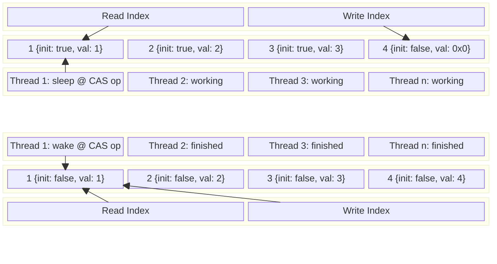

The graph above shows how the ring buffer has an ABA problem. A full loop where $write = read$ is invalid when the read index is already on the proper index set on the `CAS` operation; it will read an uninitialized value. How can this be solved? It's possible to do another initialized memory check below the `CAS` operation; this would retain unique access, but we would need a way to wait on failure... It's possible to return an error in this case instead too, but if $write + 1 = read$ it gets marked _full_ and writes won't proceed, and neither will reads because everything afterward is uninitialized. Time to look into alternative methods, but perhaps before that, implement the `loom` tests to help find these bugs lurking in concurrency.

## Loom Tests
Loom is a library that implements its own operating system scheduler so it can have direct control of the interleaving order of threads. This is a really cool idea that allows for more consistent tests instead of what was performed before—running a lot of times arbitrarily in loops. The other nice thing about it, which I don't fully understand, is how it can test the memory orderings from different systems.

Okay, the `loom` test is created, but now it fails to run due to _spin locks_. The next thing is to add spin lock hints, which will tell loom when it's in a spin lock while also allowing the compiler to optimize its behavior via CPU signals in normal compilation, which is pretty cool! 

After adding `spin lock` hints to the tests, `loom` is still complaining about them:
```
LOOM_MAX_PREEMPTIONS=4 RUSTFLAGS="--cfg loom" cargo test --all test_multi_threaded_loom --release
   Compiling limitless v0.1.0 (/Users/ken/src/limitless)
    Finished `release` profile [optimized] target(s) in 0.41s
     Running unittests src/lib.rs (target/release/deps/limitless-51c81f313e8bcfba)

running 1 test
test tests::test_multi_threaded_loom has been running for over 60 seconds
test tests::test_multi_threaded_loom ... FAILED

failures:

---- tests::test_multi_threaded_loom stdout ----

thread 'tests::test_multi_threaded_loom' (11636342) panicked at /Users/ken/.cargo/registry/src/index.crates.io-1949cf8c6b5b557f/loom-0.7.2/src/rt/path.rs:247:13:
Model exceeded maximum number of branches. This is often caused by an algorithm requiring the processor to make progress, e.g. spin locks.
```

After reducing possible branches by changing the size of the ring buffer and number of allowable preemptions, the error remains. The next thing would be to look for a flag to increase the number of branches, but for now, thinking again about the code pathways to improve it, the read and write indices could be modified so they always increase in value. The initialization could change from a boolean to the write index so that when the read index catches up to read it, they should be identical. Doing it this way potentially removes the need to have an always present empty slot since it's possible to know that $empty: write = read$ and $full: write - read = capacity$. This would take care of the issue with reads being paused because it would be impossible (unless the entire range of memory is used) for the read to happen without a matching index.

Before rewriting code, I want to attempt to debug the loom test. The first thing was adding log output to trace the loom test failure. Right now it doesn't feel very helpful in its current form. The second thing was to verify the new test actually passes in a normal test state, which works fine.

The last trace from main thread before failure looks like this upon initialization:
```plaintext
INFO iter{68004}:thread{id=0}: loom::rt::execution: ~~~~~~~~ THREAD 0 ~~~~~~~~
TRACE iter{68004}:thread{id=0}: loom::rt: thread_done: terminate thread=Id(2) switch=true
TRACE iter{68004}:thread{id=0}: loom::rt::notify: Notify::wait 2 state=Ref<loom::rt::notify::State>(10)
TRACE iter{68004}:thread{id=0}: loom::rt::object: Object::branch_action obj=Ref<loom::rt::arc::State>(8) action=RefDec
TRACE iter{68004}:thread{id=0}: loom::rt: branch switch=false
TRACE iter{68004}:thread{id=0}: loom::rt::arc: Arc::ref_dec state=Ref<loom::rt::arc::State>(8) ref_cnt=0 location=/Users/ken/.rustup/toolchains/stable-aarch64-apple-darwin/lib/rustlib/src/rust/library/core/src/ptr/mod.rs:805:1
TRACE iter{68004}:thread{id=0}: loom::rt: thread_done: drop locals thread=Id(0)
TRACE iter{68004}: loom::rt: thread_done: terminate thread=Id(0) switch=true
TRACE iter{68005}: loom::rt::atomic: Atomic::new state=Ref<loom::rt::atomic::State>(1)
TRACE iter{68005}: loom::rt::atomic: Atomic::new state=Ref<loom::rt::atomic::State>(3)
TRACE iter{68005}: loom::rt::atomic: Atomic::new state=Ref<loom::rt::atomic::State>(5)
TRACE iter{68005}: loom::rt::atomic: Atomic::new state=Ref<loom::rt::atomic::State>(6)
TRACE iter{68005}: loom::rt::atomic: Atomic::new state=Ref<loom::rt::atomic::State>(7)
TRACE iter{68005}: loom::rt::arc: Arc::new state=Ref<loom::rt::arc::State>(8) location=src/lib.rs:358:46
TRACE iter{68005}: loom::rt::object: Object::branch_action obj=Ref<loom::rt::arc::State>(8) action=RefInc
TRACE iter{68005}:thread{id=0}: loom::rt: branch switch=false
TRACE iter{68005}:thread{id=0}: loom::rt::arc: Arc::ref_inc state=Ref<loom::rt::arc::State>(8) ref_cnt=2 location=src/lib.rs:360:26
TRACE iter{68005}:thread{id=0}: loom::rt::object: Object::branch_action obj=Ref<loom::rt::arc::State>(8) action=RefInc
TRACE iter{68005}:thread{id=0}: loom::rt: branch switch=false
TRACE iter{68005}:thread{id=0}: loom::rt::arc: Arc::ref_inc state=Ref<loom::rt::arc::State>(8) ref_cnt=3 location=src/lib.rs:361:26
TRACE iter{68005}:thread{id=0}: loom::rt::notify: Notify::new state=Ref<loom::rt::notify::State>(9) seq_cst=true spurious=false
TRACE iter{68005}:thread{id=0}: loom::rt: spawn thread=Id(1)
TRACE iter{68005}:thread{id=0}: loom::rt::notify: Notify::new state=Ref<loom::rt::notify::State>(10) seq_cst=true spurious=false
TRACE iter{68005}:thread{id=0}: loom::rt: spawn thread=Id(2)
TRACE iter{68005}:thread{id=0}: loom::rt::object: Object::branch_action obj=Ref<loom::rt::atomic::State>(7) action=Load
TRACE iter{68005}:thread{id=0}: loom::rt: branch switch=false
TRACE iter{68005}:thread{id=0}: loom::rt: synchronize
TRACE iter{68005}:thread{id=0}: loom::rt::atomic: Atomic::load state=Ref<loom::rt::atomic::State>(7) ordering=Acquire
TRACE iter{68005}:thread{id=0}: loom::rt::object: Object::branch_action obj=Ref<loom::rt::atomic::State>(1) action=Load
TRACE iter{68005}:thread{id=0}: loom::rt: branch switch=false
TRACE iter{68005}:thread{id=0}: loom::rt: synchronize
TRACE iter{68005}:thread{id=0}: loom::rt::atomic: Atomic::load state=Ref<loom::rt::atomic::State>(1) ordering=Acquire
TRACE iter{68005}:thread{id=0}: loom::rt::object: Object::branch_action obj=Ref<loom::rt::atomic::State>(7) action=Load
TRACE iter{68005}:thread{id=0}: loom::rt: branch switch=false
TRACE iter{68005}:thread{id=0}: loom::rt: synchronize
TRACE iter{68005}:thread{id=0}: loom::rt::atomic: Atomic::load state=Ref<loom::rt::atomic::State>(7) ordering=Acquire
TRACE iter{68005}:thread{id=0}: loom::rt::object: Object::branch_action obj=Ref<loom::rt::atomic::State>(6) action=Load
TRACE iter{68005}:thread{id=0}: loom::rt: branch switch=false
TRACE iter{68005}:thread{id=0}: loom::rt: synchronize
TRACE iter{68005}:thread{id=0}: loom::rt::atomic: Atomic::load state=Ref<loom::rt::atomic::State>(6) ordering=Acquire
TRACE iter{68005}:thread{id=0}: loom::rt::object: Object::branch_action obj=Ref<loom::rt::atomic::State>(7) action=Rmw
TRACE iter{68005}:thread{id=0}: loom::rt: branch switch=false
TRACE iter{68005}:thread{id=0}: loom::rt: synchronize
TRACE iter{68005}:thread{id=0}: loom::rt::atomic: Atomic::rmw state=Ref<loom::rt::atomic::State>(7) success=AcqRel failure=Relaxed
TRACE iter{68005}:thread{id=0}: loom::rt: synchronize
TRACE iter{68005}:thread{id=0}: loom::rt::object: Object::branch_action obj=Ref<loom::rt::atomic::State>(1) action=Store
TRACE iter{68005}:thread{id=0}: loom::rt: branch switch=false
TRACE iter{68005}:thread{id=0}: loom::rt: synchronize
TRACE iter{68005}:thread{id=0}: loom::rt::atomic: Atomic::store state=Ref<loom::rt::atomic::State>(1) ordering=Release
TRACE iter{68005}:thread{id=0}: loom::rt::object: Object::branch_action obj=Ref<loom::rt::atomic::State>(7) action=Load
TRACE iter{68005}:thread{id=0}: loom::rt: branch switch=false
TRACE iter{68005}:thread{id=0}: loom::rt: synchronize
TRACE iter{68005}:thread{id=0}: loom::rt::atomic: Atomic::load state=Ref<loom::rt::atomic::State>(7) ordering=Acquire
TRACE iter{68005}:thread{id=0}: loom::rt::object: Object::branch_action obj=Ref<loom::rt::atomic::State>(3) action=Load
TRACE iter{68005}:thread{id=0}: loom::rt: branch switch=false
TRACE iter{68005}:thread{id=0}: loom::rt: synchronize
TRACE iter{68005}:thread{id=0}: loom::rt::atomic: Atomic::load state=Ref<loom::rt::atomic::State>(3) ordering=Acquire
TRACE iter{68005}:thread{id=0}: loom::rt::object: Object::branch_action obj=Ref<loom::rt::atomic::State>(7) action=Load
TRACE iter{68005}:thread{id=0}: loom::rt: branch switch=false
TRACE iter{68005}:thread{id=0}: loom::rt: synchronize
TRACE iter{68005}:thread{id=0}: loom::rt::atomic: Atomic::load state=Ref<loom::rt::atomic::State>(7) ordering=Acquire
TRACE iter{68005}:thread{id=0}: loom::rt::object: Object::branch_action obj=Ref<loom::rt::atomic::State>(6) action=Load
TRACE iter{68005}:thread{id=0}: loom::rt: branch switch=false
TRACE iter{68005}:thread{id=0}: loom::rt: synchronize
TRACE iter{68005}:thread{id=0}: loom::rt::atomic: Atomic::load state=Ref<loom::rt::atomic::State>(6) ordering=Acquire
TRACE iter{68005}:thread{id=0}: loom::rt::object: Object::branch_action obj=Ref<loom::rt::atomic::State>(7) action=Rmw
TRACE iter{68005}:thread{id=0}: loom::rt: branch switch=false
TRACE iter{68005}:thread{id=0}: loom::rt: synchronize
TRACE iter{68005}:thread{id=0}: loom::rt::atomic: Atomic::rmw state=Ref<loom::rt::atomic::State>(7) success=AcqRel failure=Relaxed
TRACE iter{68005}:thread{id=0}: loom::rt: synchronize
TRACE iter{68005}:thread{id=0}: loom::rt::object: Object::branch_action obj=Ref<loom::rt::atomic::State>(3) action=Store
```
Next the main thread after passing off execution to the two read threads for a bit looks like:
```plaintext
INFO iter{68005}:thread{id=0}: loom::rt::execution: ~~~~~~~~ THREAD 0 ~~~~~~~~
TRACE iter{68005}:thread{id=0}: loom::rt: yield_now thread=Id(1) switch=true
TRACE iter{68005}:thread{id=0}: loom::rt: synchronize
TRACE iter{68005}:thread{id=0}: loom::rt::atomic: Atomic::store state=Ref<loom::rt::atomic::State>(3) ordering=Release
TRACE iter{68005}:thread{id=0}: loom::rt::object: Object::branch_action obj=Ref<loom::rt::atomic::State>(7) action=Load
TRACE iter{68005}:thread{id=0}: loom::rt: branch switch=false
TRACE iter{68005}:thread{id=0}: loom::rt: synchronize
TRACE iter{68005}:thread{id=0}: loom::rt::atomic: Atomic::load state=Ref<loom::rt::atomic::State>(7) ordering=Acquire
TRACE iter{68005}:thread{id=0}: loom::rt::object: Object::branch_action obj=Ref<loom::rt::atomic::State>(5) action=Load
TRACE iter{68005}:thread{id=0}: loom::rt: branch switch=false
TRACE iter{68005}:thread{id=0}: loom::rt: synchronize
TRACE iter{68005}:thread{id=0}: loom::rt::atomic: Atomic::load state=Ref<loom::rt::atomic::State>(5) ordering=Acquire
TRACE iter{68005}:thread{id=0}: loom::rt::object: Object::branch_action obj=Ref<loom::rt::atomic::State>(7) action=Load
TRACE iter{68005}:thread{id=0}: loom::rt: branch switch=false
TRACE iter{68005}:thread{id=0}: loom::rt: synchronize
TRACE iter{68005}:thread{id=0}: loom::rt::atomic: Atomic::load state=Ref<loom::rt::atomic::State>(7) ordering=Acquire
TRACE iter{68005}:thread{id=0}: loom::rt::object: Object::branch_action obj=Ref<loom::rt::atomic::State>(6) action=Load
TRACE iter{68005}:thread{id=0}: loom::rt: branch switch=false
TRACE iter{68005}:thread{id=0}: loom::rt: synchronize
TRACE iter{68005}:thread{id=0}: loom::rt::atomic: Atomic::load state=Ref<loom::rt::atomic::State>(6) ordering=Acquire
TRACE iter{68005}:thread{id=0}: loom::rt::object: Object::branch_action obj=Ref<loom::rt::atomic::State>(7) action=Rmw
TRACE iter{68005}:thread{id=0}: loom::rt: branch switch=false
TRACE iter{68005}:thread{id=0}: loom::rt: synchronize
TRACE iter{68005}:thread{id=0}: loom::rt::atomic: Atomic::rmw state=Ref<loom::rt::atomic::State>(7) success=AcqRel failure=Relaxed
TRACE iter{68005}:thread{id=0}: loom::rt: synchronize
TRACE iter{68005}:thread{id=0}: loom::rt::object: Object::branch_action obj=Ref<loom::rt::atomic::State>(5) action=Store
TRACE iter{68005}:thread{id=0}: loom::rt: branch switch=false
TRACE iter{68005}:thread{id=0}: loom::rt: synchronize
TRACE iter{68005}:thread{id=0}: loom::rt::atomic: Atomic::store state=Ref<loom::rt::atomic::State>(5) ordering=Release
TRACE iter{68005}:thread{id=0}: loom::rt::notify: Notify::wait 1 state=Ref<loom::rt::notify::State>(9) notified=false spurious=false
TRACE iter{68005}:thread{id=0}: loom::rt::object: Object::branch_acquire obj=Ref<loom::rt::notify::State>(9) is_locked=true
```
It shows that it's done some new work in the `Rmw` action (read-modify-write) and finally exits by waiting for the other two threads:
```plaintext
INFO iter{68005}:thread{id=0}: loom::rt::execution: ~~~~~~~~ THREAD 0 ~~~~~~~~
TRACE iter{68005}:thread{id=0}: loom::rt: thread_done: terminate thread=Id(1) switch=true
TRACE iter{68005}:thread{id=0}: loom::rt::notify: Notify::wait 2 state=Ref<loom::rt::notify::State>(9)
TRACE iter{68005}:thread{id=0}: loom::rt::notify: Notify::wait 1 state=Ref<loom::rt::notify::State>(10) notified=false spurious=false
TRACE iter{68005}:thread{id=0}: loom::rt::object: Object::branch_acquire obj=Ref<loom::rt::notify::State>(10) is_locked=true
```
The read threads basically cycle between these two states often with no deviation:
```plaintext
 INFO iter{68005}:thread{id=1}: loom::rt::execution: ~~~~~~~~ THREAD 1 ~~~~~~~~
TRACE iter{68005}:thread{id=1}: loom::rt: yield_now thread=Id(2) switch=true
TRACE iter{68005}:thread{id=1}: loom::rt::object: Object::branch_action obj=Ref<loom::rt::atomic::State>(6) action=Load
TRACE iter{68005}:thread{id=1}: loom::rt: branch switch=false
TRACE iter{68005}:thread{id=1}: loom::rt: synchronize
TRACE iter{68005}:thread{id=1}: loom::rt::atomic: Atomic::load state=Ref<loom::rt::atomic::State>(6) ordering=Acquire
TRACE iter{68005}:thread{id=1}: loom::rt::object: Object::branch_action obj=Ref<loom::rt::atomic::State>(7) action=Load
TRACE iter{68005}:thread{id=1}: loom::rt: branch switch=false
TRACE iter{68005}:thread{id=1}: loom::rt: synchronize
TRACE iter{68005}:thread{id=1}: loom::rt::atomic: Atomic::load state=Ref<loom::rt::atomic::State>(7) ordering=Acquire
TRACE iter{68005}:thread{id=1}: loom::rt::object: Object::branch_action obj=Ref<loom::rt::atomic::State>(6) action=Load
TRACE iter{68005}:thread{id=1}: loom::rt: branch switch=false
TRACE iter{68005}:thread{id=1}: loom::rt: synchronize
TRACE iter{68005}:thread{id=1}: loom::rt::atomic: Atomic::load state=Ref<loom::rt::atomic::State>(6) ordering=Acquire
TRACE iter{68005}:thread{id=1}: loom::rt::object: Object::branch_action obj=Ref<loom::rt::atomic::State>(3) action=Load
TRACE iter{68005}:thread{id=1}: loom::rt: branch switch=false
TRACE iter{68005}:thread{id=1}: loom::rt: synchronize
TRACE iter{68005}:thread{id=1}: loom::rt::atomic: Atomic::load state=Ref<loom::rt::atomic::State>(3) ordering=Acquire
 INFO iter{68005}:thread{id=2}: loom::rt::execution: ~~~~~~~~ THREAD 2 ~~~~~~~~
TRACE iter{68005}:thread{id=2}: loom::rt: yield_now thread=Id(1) switch=true
TRACE iter{68005}:thread{id=2}: loom::rt::object: Object::branch_action obj=Ref<loom::rt::atomic::State>(6) action=Load
TRACE iter{68005}:thread{id=2}: loom::rt: branch switch=false
TRACE iter{68005}:thread{id=2}: loom::rt: synchronize
TRACE iter{68005}:thread{id=2}: loom::rt::atomic: Atomic::load state=Ref<loom::rt::atomic::State>(6) ordering=Acquire
TRACE iter{68005}:thread{id=2}: loom::rt::object: Object::branch_action obj=Ref<loom::rt::atomic::State>(7) action=Load
TRACE iter{68005}:thread{id=2}: loom::rt: branch switch=false
TRACE iter{68005}:thread{id=2}: loom::rt: synchronize
TRACE iter{68005}:thread{id=2}: loom::rt::atomic: Atomic::load state=Ref<loom::rt::atomic::State>(7) ordering=Acquire
TRACE iter{68005}:thread{id=2}: loom::rt::object: Object::branch_action obj=Ref<loom::rt::atomic::State>(6) action=Load
TRACE iter{68005}:thread{id=2}: loom::rt: branch switch=false
TRACE iter{68005}:thread{id=2}: loom::rt: synchronize
TRACE iter{68005}:thread{id=2}: loom::rt::atomic: Atomic::load state=Ref<loom::rt::atomic::State>(6) ordering=Acquire
TRACE iter{68005}:thread{id=2}: loom::rt::object: Object::branch_action obj=Ref<loom::rt::atomic::State>(3) action=Load
TRACE iter{68005}:thread{id=2}: loom::rt: branch switch=false
TRACE iter{68005}:thread{id=2}: loom::rt: synchronize
TRACE iter{68005}:thread{id=2}: loom::rt::atomic: Atomic::load state=Ref<loom::rt::atomic::State>(3) ordering=Acquire
```
The last line gives a small clue potentially, the `Acquire` ordering in the read only happens in two places in the main read function, and furthest one down is when it checks for initialized memory:
```rust
if !self.buffer[idx].initialized.load(Ordering::Acquire) {
    // spin until initialized
    spin_loop();
    continue;
}
```
It's not exactly a spin loop, but it definitely loops either waiting for a change in index or a change in its current memory state and both must be in the correct position. So in these loops it appears that both read threads are fighting for the same index in memory to read from and they are uninitialized, which is fine, there's no issue here. The last bit of the read threads goes here:
```plaintext
 INFO iter{68005}:thread{id=2}: loom::rt::execution: ~~~~~~~~ THREAD 2 ~~~~~~~~
TRACE iter{68005}:thread{id=2}: loom::rt: branch switch=true
TRACE iter{68005}:thread{id=2}: loom::rt: synchronize
TRACE iter{68005}:thread{id=2}: loom::rt::atomic: Atomic::rmw state=Ref<loom::rt::atomic::State>(6) success=AcqRel failure=Relaxed
TRACE iter{68005}:thread{id=2}: loom::rt: yield_now thread=Id(2) switch=false
TRACE iter{68005}:thread{id=2}: loom::rt::object: Object::branch_action obj=Ref<loom::rt::atomic::State>(6) action=Load
TRACE iter{68005}:thread{id=2}: loom::rt: branch switch=false
TRACE iter{68005}:thread{id=2}: loom::rt: synchronize
TRACE iter{68005}:thread{id=2}: loom::rt::atomic: Atomic::load state=Ref<loom::rt::atomic::State>(6) ordering=Acquire
TRACE iter{68005}:thread{id=2}: loom::rt::object: Object::branch_action obj=Ref<loom::rt::atomic::State>(7) action=Load
TRACE iter{68005}:thread{id=2}: loom::rt: branch switch=false
TRACE iter{68005}:thread{id=2}: loom::rt: synchronize
TRACE iter{68005}:thread{id=2}: loom::rt::atomic: Atomic::load state=Ref<loom::rt::atomic::State>(7) ordering=Acquire
TRACE iter{68005}:thread{id=2}: loom::rt::object: Object::branch_action obj=Ref<loom::rt::atomic::State>(6) action=Load
TRACE iter{68005}:thread{id=2}: loom::rt: branch switch=false
TRACE iter{68005}:thread{id=2}: loom::rt: synchronize
TRACE iter{68005}:thread{id=2}: loom::rt::atomic: Atomic::load state=Ref<loom::rt::atomic::State>(6) ordering=Acquire
TRACE iter{68005}:thread{id=2}: loom::rt::object: Object::branch_action obj=Ref<loom::rt::atomic::State>(5) action=Load
TRACE iter{68005}:thread{id=2}: loom::rt: branch switch=false
TRACE iter{68005}:thread{id=2}: loom::rt: synchronize
TRACE iter{68005}:thread{id=2}: loom::rt::atomic: Atomic::load state=Ref<loom::rt::atomic::State>(5) ordering=Acquire
TRACE iter{68005}:thread{id=2}: loom::rt: yield_now thread=Id(2) switch=false
TRACE iter{68005}:thread{id=2}: loom::rt::object: Object::branch_action obj=Ref<loom::rt::atomic::State>(6) action=Load
TRACE iter{68005}:thread{id=2}: loom::rt: branch switch=false
TRACE iter{68005}:thread{id=2}: loom::rt: synchronize
TRACE iter{68005}:thread{id=2}: loom::rt::atomic: Atomic::load state=Ref<loom::rt::atomic::State>(6) ordering=Acquire
TRACE iter{68005}:thread{id=2}: loom::rt::object: Object::branch_action obj=Ref<loom::rt::atomic::State>(7) action=Load
TRACE iter{68005}:thread{id=2}: loom::rt: branch switch=false
TRACE iter{68005}:thread{id=2}: loom::rt: synchronize
TRACE iter{68005}:thread{id=2}: loom::rt::atomic: Atomic::load state=Ref<loom::rt::atomic::State>(7) ordering=Acquire
TRACE iter{68005}:thread{id=2}: loom::rt::object: Object::branch_action obj=Ref<loom::rt::atomic::State>(6) action=Load
TRACE iter{68005}:thread{id=2}: loom::rt: branch switch=false
TRACE iter{68005}:thread{id=2}: loom::rt: synchronize
TRACE iter{68005}:thread{id=2}: loom::rt::atomic: Atomic::load state=Ref<loom::rt::atomic::State>(6) ordering=Acquire
TRACE iter{68005}:thread{id=2}: loom::rt::object: Object::branch_action obj=Ref<loom::rt::atomic::State>(5) action=Load
TRACE iter{68005}:thread{id=2}: loom::rt: branch switch=false
TRACE iter{68005}:thread{id=2}: loom::rt: synchronize
TRACE iter{68005}:thread{id=2}: loom::rt::atomic: Atomic::load state=Ref<loom::rt::atomic::State>(5) ordering=Acquire
TRACE iter{68005}:thread{id=2}: loom::rt::object: Object::branch_action obj=Ref<loom::rt::atomic::State>(6) action=Rmw
TRACE iter{68005}:thread{id=2}: loom::rt: branch switch=false
TRACE iter{68005}:thread{id=2}: loom::rt: synchronize

thread 'loom_tests::test_multi_threaded_loom' (1123249) panicked at /Users/ken/.cargo/registry/src/index.crates.io-1949cf8c6b5b557f/loom-0.7.2/src/rt/path.rs:175:9:
Model exceeded maximum number of branches. This is often caused by an algorithm requiring the processor to make progress, e.g. spin locks.
stack backtrace:
   0:        0x1004acc48 - <<std[bb513d90a5cee88a]::sys::backtrace::BacktraceLock>::print::DisplayBacktrace as core[f63e075e1375d836]::fmt::Display>::fmt
   1:        0x1004beabc - core[f63e075e1375d836]::fmt::write
   2:        0x1004b0b58 - <alloc[1519c0c6343f008f]::vec::Vec<u8> as std[bb513d90a5cee88a]::io::Write>::write_fmt
   3:        0x100493ff4 - std[bb513d90a5cee88a]::panicking::default_hook::{closure#0}
   4:        0x1004a668c - std[bb513d90a5cee88a]::panicking::default_hook
   5:        0x1003e39d4 - test[83d61c8db1bee592]::test_main_with_exit_callback::<test[83d61c8db1bee592]::test_main::{closure#0}>::{closure#0}
   6:        0x10047f5a8 - generator::detail::gen::catch_unwind_filter::{{closure}}::{{closure}}::hab6dff4db5e757a9
   7:        0x1004a6a44 - std[bb513d90a5cee88a]::panicking::panic_with_hook
   8:        0x1004933b8 - std[bb513d90a5cee88a]::panicking::begin_panic::<&str>::{closure#0}
   9:        0x10048b27c - std[bb513d90a5cee88a]::sys::backtrace::__rust_end_short_backtrace::<std[bb513d90a5cee88a]::panicking::begin_panic<&str>::{closure#0}, !>
  10:        0x1004d1ec0 - std[bb513d90a5cee88a]::panicking::begin_panic::<&str>
  11:        0x10041e4a0 - loom::rt::path::Path::push_load::hfd64ca1337aae1a7
  12:        0x10040d3e8 - scoped_tls::ScopedKey<T>::with::h4860e3f3d9851062
  13:        0x100410ca0 - loom::rt::atomic::Atomic<T>::rmw::h71f2c2279101b927
  14:        0x10041b4fc - loom::sync::atomic::int::AtomicUsize::compare_exchange_weak::hb2fec93bc270cd45
  15:        0x1003d607c - limitless::RingBuffer<T>::read::h51aa324dea7cc8df
  16:        0x1003d7f3c - core::ops::function::FnOnce::call_once{{vtable.shim}}::h4fbe1c5c68eba971
  17:        0x10041c328 - generator::stack::StackBox<F>::call_once::h7503f5f264a34505
  18:        0x10047f48c - generator::detail::gen::catch_unwind_filter::hd8b2cc5972367ed0
  19:        0x10047fc64 - generator::detail::gen::gen_init_impl::h2bfa5980af9b5af2
  20:        0x10047fc38 - generator::detail::asm::gen_init::h7da2e78034a82188
TRACE iter{68005}:thread{id=2}: loom::rt::object: Object::branch_action obj=Ref<loom::rt::arc::State>(8) action=RefDec
TRACE iter{68005}:thread{id=2}: loom::rt: branch switch=false
TRACE iter{68005}:thread{id=2}: loom::rt::arc: Arc::ref_dec state=Ref<loom::rt::arc::State>(8) ref_cnt=1 location=/Users/ken/.rustup/toolchains/stable-aarch64-apple-darwin/lib/rustlib/src/rust/library/core/src/ptr/mod.rs:805:1
```
This looks okay; it exits when it's finished. The only potential gap that seems present is in the second thread with no `Store` action after the `Rmw`, which indicates that it is failing the `Rmw` operation, implying that thread one performed the real operation. Looking at potential tunable[^3] options for `loom`, the limit's been reached unless heuristics on depth and permutations are used.

The problem space possible is at least $[3_\text{threads}, 16_\text{atomic ops}, 3_\text{loop iterations}] = 19! \times 3$, which is very large (it could be larger), making it clear that it is quite possible to have a lot of branches. Limiting that to two preemptions already limits the space quite a bit, reducing it to the lowest possible iteration count/ring buffer size too. If there's a way to reduce the number of atomic operations, that would also help quite a bit.

Alright, while waiting for this test to run let's think about another method for solving the ABA problem.

Doing it this way removes the need to have an always present empty slot potentially since it's possible to know that $empty: write = read$ and $full: write - read = capacity$. This would take care of the issue with reads being paused because it would be impossible (unless the entire range of memory is used) for the read to happen without a matching index.

What doesn't get handled now though is what it might mean to be uninitialized. What does that look like? Currently the _slot_ looks like:
```rust
Slot {
  initalized: bool,
  data: MaybeUninit<T>,
}
```
but the change would be specifically to something like:
```rust
Slot {
  init_stamp: usize,
  data: MaybeUninit<T>,
}
```
If a special number like $0$ is used to indicate initialization, then we have to handle that case specially and check for it in every case, which kinda sucks. That would be true with any number, because you might get the case where you wrap eventually and break everything if you're not careful.

What if initialization specifically meant `init_stamp == read_idx`? It would require read index be checked but... issues around initialization being too fast or paused do go away. There would be special cases that potentially break this:
- wrapping back around to zero
- starting at a zero index given initialization state is ambiguous
Wrapping back to zero would break the $write - read = capacity$ check; it could also be calculated as $write \mod capacity = read \mod capacity : write \neq read$. It could also be possible to add a different flag indicating the write wrapped and reset it to normal when the read wraps, but it's also a little goofy. How can this be made more elegant than a modulus chain? Can the index use `abs_diff` instead? The most likely best performing approach would probably just let the read catch up during a wrap.
```rust
if read > write {
  // treat as full, don't accept a write
}
```
Other approaches definitely work but also, they require more logic. In the chance someone does hit this number, it is a weird side effect to pause to catch up, but it's also unlikely. 
$$
usize = 2^{64} - 1 = 18{,}446{,}744{,}073{,}709{,}551{,}615
$$
$$
4_{GHz} = \text{processor speed}
$$
$$
\frac{18{,}446{,}744{,}073{,}709{,}551{,}615}{4{,}000{,}000{,}000} = 4{,}611{,}686{,}018_{sec} \approx 146_{years}
$$
If every _slot_ is initialized to zero in its stamp, ambiguity can be removed by setting the read and write indices to $1$. This would be handled normally and the array would be the same size and a wrap would ultimately not affect it since a read index of $0$ at that point would be a proper initialized index from a properly timed write.

After giving it some more thought, that initial calculation is solely based on single threaded performance, it could be more feasible with larger core counts:
$$
\frac{146_{years}}{cores}
$$
The assumption being made though is that the processor is doing nothing but incrementing the index non-stop with all its cores. Given this unlikely scenario, this case gets bucketed to _less important_ since it is far more likely that the system will be replaced before an overflow ever has a chance to occur, at least on a $64_{bit}$ system.

Okay, so the current changes have been made but now there seems to be an actual issue again, time to look at LLDB:
```lldb
(lldb) bt all
* thread #1, name = 'main', queue = 'com.apple.main-thread', stop reason = signal SIGSTOP
  * frame #0: 0x00000001866c7af8 libsystem_kernel.dylib`__ulock_wait + 8
    frame #1: 0x000000018670c114 libsystem_pthread.dylib`_pthread_join + 616
    frame #2: 0x0000000100566c94 limitless`<std::sys::thread::unix::Thread>::join + 24
    frame #3: 0x0000000100556f9c limitless`limitless::main::hce592d2cf5a830bd + 748
    frame #4: 0x0000000100554cf8 limitless`std::sys::backtrace::__rust_begin_short_backtrace::he0a07bb0561f25fb + 12
    frame #5: 0x0000000100554988 limitless`std::rt::lang_start::_$u7b$$u7b$closure$u7d$$u7d$::h730c63e5e836dfa9 + 16
    frame #6: 0x0000000100571960 limitless`std::rt::lang_start_internal + 952
    frame #7: 0x00000001005575b4 limitless`main + 52
    frame #8: 0x000000018634be00 dyld`start + 6992
  thread #2
    frame #0: 0x0000000100554a18 limitless`std::sys::backtrace::__rust_begin_short_backtrace::h28257366e5b1443e + 132
    frame #1: 0x0000000100555c70 limitless`core::ops::function::FnOnce::call_once$u7b$$u7b$vtable.shim$u7d$$u7d$::hc27068ea6799aaca + 88
    frame #2: 0x000000010057772c limitless`<std::sys::thread::unix::Thread>::new::thread_start + 408
    frame #3: 0x0000000186709c58 libsystem_pthread.dylib`_pthread_start + 136
  thread #3
    frame #0: 0x0000000100554a18 limitless`std::sys::backtrace::__rust_begin_short_backtrace::h28257366e5b1443e + 132
    frame #1: 0x0000000100555c70 limitless`core::ops::function::FnOnce::call_once$u7b$$u7b$vtable.shim$u7d$$u7d$::hc27068ea6799aaca + 88
    frame #2: 0x000000010057772c limitless`<std::sys::thread::unix::Thread>::new::thread_start + 408
    frame #3: 0x0000000186709c58 libsystem_pthread.dylib`_pthread_start + 136
  thread #4
    frame #0: 0x0000000100554a18 limitless`std::sys::backtrace::__rust_begin_short_backtrace::h28257366e5b1443e + 132
    frame #1: 0x0000000100555c70 limitless`core::ops::function::FnOnce::call_once$u7b$$u7b$vtable.shim$u7d$$u7d$::hc27068ea6799aaca + 88
    frame #2: 0x000000010057772c limitless`<std::sys::thread::unix::Thread>::new::thread_start + 408
    frame #3: 0x0000000186709c58 libsystem_pthread.dylib`_pthread_start + 136
  thread #5
    frame #0: 0x0000000100554a18 limitless`std::sys::backtrace::__rust_begin_short_backtrace::h28257366e5b1443e + 132
    frame #1: 0x0000000100555c70 limitless`core::ops::function::FnOnce::call_once$u7b$$u7b$vtable.shim$u7d$$u7d$::hc27068ea6799aaca + 88
    frame #2: 0x000000010057772c limitless`<std::sys::thread::unix::Thread>::new::thread_start + 408
    frame #3: 0x0000000186709c58 libsystem_pthread.dylib`_pthread_start + 136
  thread #6
    frame #0: 0x0000000100554a18 limitless`std::sys::backtrace::__rust_begin_short_backtrace::h28257366e5b1443e + 132
    frame #1: 0x0000000100555c70 limitless`core::ops::function::FnOnce::call_once$u7b$$u7b$vtable.shim$u7d$$u7d$::hc27068ea6799aaca + 88
    frame #2: 0x000000010057772c limitless`<std::sys::thread::unix::Thread>::new::thread_start + 408
    frame #3: 0x0000000186709c58 libsystem_pthread.dylib`_pthread_start + 136
  thread #7
    frame #0: 0x0000000100554a18 limitless`std::sys::backtrace::__rust_begin_short_backtrace::h28257366e5b1443e + 132
    frame #1: 0x0000000100555c70 limitless`core::ops::function::FnOnce::call_once$u7b$$u7b$vtable.shim$u7d$$u7d$::hc27068ea6799aaca + 88
    frame #2: 0x000000010057772c limitless`<std::sys::thread::unix::Thread>::new::thread_start + 408
    frame #3: 0x0000000186709c58 libsystem_pthread.dylib`_pthread_start + 136
```
Everything is a write thread, all the reads have exited, but can it be reproduced with a non-release run? Yes!
```lldb
(lldb) thread select 7
* thread #7
    frame #0: 0x00000001002ad980 limitless`core::core_arch::arm_shared::barrier::__isb::h45488481cdc5e3e4(arg=SY @ 0x00000001711daab7) at mod.rs:145:2 [inlined]
   142      A: super::sealed::Isb,
   143  {
   144      arg.__isb()
-> 145  }
   146
   147  unsafe extern "unadjusted" {
   148      #[cfg_attr(
(lldb) frame select 2
frame #2: 0x00000001002ad97c limitless`limitless::RingBuffer$LT$T$GT$::write::h1dd0444d2f831b45(self=0x0000000100362670, v=2) at lib.rs:123:17
   120              let i = idx % self.capacity;
   121              if self.buffer[i].stamp.load(Ordering::Acquire) >= ridx {
   122                  // spin until uninitialized
-> 123                  spin_loop();
   124                  continue;
   125              }
   126              if self.full(ridx, idx) {
(lldb) frame variable
(limitless::RingBuffer<unsigned long> *) self = 0x0000000100362670
(unsigned long) v = 2
(unsigned long) idx = 19799
(unsigned long) ridx = 3415
(unsigned long) i = 3415
(lldb) frame select 3
frame #3: 0x00000001002a7bc4 limitless`limitless::main::_$u7b$$u7b$closure$u7d$$u7d$::h84a0d4e87fe06061 at main.rs:34:32
   31                       println!("write enter");
   32                       for _ in 0..SIZE {
   33                           // complete regardless of contention
-> 34                           if rbc.write(2).is_err() {
   35                               se.fetch_add(1, Ordering::AcqRel);
   36                           }
   37                       }
(lldb) frame variable
(alloc::sync::Arc<limitless::RingBuffer<unsigned long>, alloc::alloc::Global>) rbc = strong=7, weak=0 {
  data = {
    buffer = {
      data_ptr = 0x0000000b46800000
      length = 16384
    }
    capacity = 16384
    read_idx = {
      v = {
        value = 3415
      }
    }
    write_idx = {
      v = {
        value = 19799
      }
    }
  }
}
(alloc::sync::Arc<core::sync::atomic::AtomicUsize, alloc::alloc::Global>) se = strong=7, weak=0 {
  data = {
    v = {
      value = 0
    }
  }
}
(core::ops::range::Range<unsigned long>) iter = {
  start = 2762
  end = 16384
}
```
Looks like all threads are essentially in a spin loop, and the prime suspect is that the initialization math is wrong. The issue shows that $write - read = 16384 = capacity$, so the issue comes up when the buffer is full... The full check comes after the buffer initialization read, which should catch the same exact state but exit. So instead of: 
```rust
self.buffer[i].stamp.load(Ordering::Acquire) >= ridx
```
it's modified to this to pass through
```rust
self.buffer[i].stamp.load(Ordering::Acquire) > ridx
```
All the threads would exit in this case on the _full_ check later since the read index would be equal to the write index, but the stamp would also be exactly equal to the read index, which is technically an invalid state but caught later. There is also no race because it's using the same index stored locally at the beginning, but if there were a race, it shouldn't matter. Now tests are passing again, and a regular run iterated through $29{,}575$ cases without issues.

The _loom_ tests are now a little more moderated. It doesn't seem possible to be able to get an _ABA_ at least not with:
```plaintext
3 threads
100,000 branches
2 preemptions
```
The test is simplified but now it's also modified the amount of time it runs before considering it a pass (2 minutes). The second test is very simple and essentially just runs against two threads to completion without issues being verified under loom's execution model. It's not the most satisfying result but there's more that can be done. I did however, expect the first test to be a more representative scenario and thinking that the CDSChecker based DPOR algorithm _loom_ relies on would be sufficient.
> _dynamic partial-order reduction_ algorithm can reduce the explored state space by exploring only those executions whose visible behavior may differ from the behavior of previously-explored executions.

Right now, the ring buffer looks like this:
```rust
#[derive(Debug)]
struct Slot<T> {
    data: UnsafeCell<MaybeUninit<T>>,
    stamp: AtomicUsize,
}

#[derive(Debug)]
pub struct RingBuffer<T> {
    buffer: Box<[Slot<T>]>,
    capacity: usize,
    read_idx: AtomicUsize,
    write_idx: AtomicUsize,
}

unsafe impl<T> Send for RingBuffer<T> {}
unsafe impl<T> Sync for RingBuffer<T> {}

impl<T> RingBuffer<T> {
    pub fn new(capacity: usize) -> Self {
        let buffer: Box<[Slot<T>]> = (0..capacity)
            .map(|_| Slot {
                data: UnsafeCell::new(MaybeUninit::uninit()),
                stamp: AtomicUsize::new(0),
            })
            .collect();
        Self {
            buffer,
            capacity,
            read_idx: AtomicUsize::new(1),
            write_idx: AtomicUsize::new(1),
        }
    }

    pub fn is_full(&self) -> bool {
        self.write_idx
            .load(Ordering::Acquire)
            .abs_diff(self.read_idx.load(Ordering::Acquire))
            >= self.capacity
    }

    pub fn is_empty(&self) -> bool {
        self.write_idx.load(Ordering::Acquire) == self.read_idx.load(Ordering::Acquire)
    }

    fn full(&self, r: usize, w: usize) -> bool {
        w.abs_diff(r) >= self.capacity
    }

    fn empty(&self, r: usize, w: usize) -> bool {
        w == r
    }

    pub fn read(&self) -> Result<T, ()> {
        let rr: T;
        loop {
            let idx = self.read_idx.load(Ordering::Acquire);
            let widx = self.write_idx.load(Ordering::Acquire);
            let i = idx % self.capacity;
            if self.empty(idx, widx) {
                return Err(());
            }
            if self.buffer[i].stamp.load(Ordering::Acquire) != idx {
                spin_loop();
                continue;
            }
            if self
                .read_idx
                .compare_exchange_weak(
                    idx,
                    idx.wrapping_add(1),
                    Ordering::AcqRel,
                    Ordering::Relaxed,
                )
                .is_err()
            {
                spin_loop();
                continue;
            };
            cfg_if::cfg_if! {
                if #[cfg(loom)] {
                    rr = unsafe {self.buffer[i].data.with(|ptr| core::ptr::read(ptr).assume_init())};
                } else {
                    rr = unsafe { core::ptr::read(self.buffer[i].data.get()).assume_init() };
                }
            };
            break;
        }
        Ok(rr)
    }

    pub fn write(&self, v: T) -> Result<(), ()> {
        loop {
            let idx = self.write_idx.load(Ordering::Acquire);
            let ridx = self.read_idx.load(Ordering::Acquire);
            let i = idx % self.capacity;
            if self.buffer[i].stamp.load(Ordering::Acquire) > ridx {
                spin_loop();
                continue;
            }
            if self.full(ridx, idx) {
                return Err(());
            }
            if self
                .write_idx
                .compare_exchange_weak(
                    idx,
                    idx.wrapping_add(1),
                    Ordering::AcqRel,
                    Ordering::Relaxed,
                )
                .is_err()
            {
                spin_loop();
                continue;
            };
            cfg_if::cfg_if! {
                if #[cfg(loom)] {
                    unsafe { self.buffer[i].data.with_mut(|ptr| core::ptr::write(ptr, MaybeUninit::new(v))) }
                } else {
                    unsafe { core::ptr::write(self.buffer[i].data.get(), MaybeUninit::new(v)) }
                }
            };
            self.buffer[i].stamp.store(idx, Ordering::Release);
            break;
        }
        Ok(())
    }
}
```

Since the current tests utilize `usize` as its data source, it would be better to add an additional test that doesn't use a `Copy` type to catch issues with unhandled drops and dereferences. The non-copy test also passes without issue but a new problem popped up. The non-loom tests when being run occasionally panic, specifically the non-copy type one. Somehow the `HashMap` key is showing up as unavailable which should not be happening in this test case. After modifying the `Copy` type loom test, it shows a new failure with useful output!
```plaintext
---- loom_tests::test_two_threads stdout ----

thread 'loom_tests::test_two_threads' (6840887) panicked at /Users/ken/.cargo/registry/src/index.crates.io-1949cf8c6b5b557f/loom-0.7.2/src/rt/location.rs:115:9:
Causality violation: Concurrent read and write accesses to `UnsafeCell`.

stack backtrace:
   0:        0x102efd3c8 - <<std[bb513d90a5cee88a]::sys::backtrace::BacktraceLock>::print::DisplayBacktrace as core[f63e075e1375d836]::fmt::Display>::fmt
   1:        0x102f0f23c - core[f63e075e1375d836]::fmt::write
   2:        0x102f012d8 - <alloc[1519c0c6343f008f]::vec::Vec<u8> as std[bb513d90a5cee88a]::io::Write>::write_fmt
   3:        0x102ee4774 - std[bb513d90a5cee88a]::panicking::default_hook::{closure#0}
   4:        0x102ef6e0c - std[bb513d90a5cee88a]::panicking::default_hook
   5:        0x102e34dc0 - test[83d61c8db1bee592]::test_main_with_exit_callback::<test[83d61c8db1bee592]::test_main::{closure#0}>::{closure#0}
   6:        0x102ecfd28 - generator::detail::gen::catch_unwind_filter::{{closure}}::{{closure}}::h9954dfd9214fb340
   7:        0x102ef71c4 - std[bb513d90a5cee88a]::panicking::panic_with_hook
   8:        0x102ee4820 - std[bb513d90a5cee88a]::panicking::panic_handler::{closure#0}
   9:        0x102edba08 - std[bb513d90a5cee88a]::sys::backtrace::__rust_end_short_backtrace::<std[bb513d90a5cee88a]::panicking::panic_handler::{closure#0}, !>
  10:        0x102ee5010 - __rustc[b7974e8690430dd9]::rust_begin_unwind
  11:        0x102f24e88 - core[f63e075e1375d836]::panicking::panic_fmt
  12:        0x102e6dcac - loom::rt::location::PanicBuilder::fire::h6582c03599afcea4
  13:        0x102e665c8 - loom::rt::cell::State::track_write::he24eb3bd2a6deee2
  14:        0x102e60f28 - scoped_tls::ScopedKey<T>::with::he92c418871bf2829
  15:        0x102e65c48 - loom::rt::cell::Cell::start_write::h730fb3d2f015e36c
  16:        0x102e25454 - limitless::RingBuffer<T>::write::ha430f195ba1a49ec
  17:        0x102e25f40 - core::ops::function::FnOnce::call_once{{vtable.shim}}::h6b76d51fdc604cf1
  18:        0x102e6cf5c - generator::stack::StackBox<F>::call_once::h508a294e61b27b06
  19:        0x102ecfc0c - generator::detail::gen::catch_unwind_filter::h5777078e6538e926
  20:        0x102ed03e4 - generator::detail::gen::gen_init_impl::h3c6e1e364615c74d
  21:        0x102ed03b8 - generator::detail::asm::gen_init::h94fcc995c2db3568


failures:
    loom_tests::test_two_threads

test result: FAILED. 2 passed; 1 failed; 0 ignored; 0 measured; 0 filtered out; finished in 188.06s
The clue _loom_ reveals is really good; there is a read/write race condition, so now we get to think about how it can occur. It suggests the occurrence is on the bounds of being empty or full. Looking at a potential write conflict when empty, it couldn't happen since the last operation marks the space as initiated. The plot thickens: with multiple readers allowed, a separate thread can still come in and perform a read while the thread is paused on the index, so providing an index heuristic, like $idx + 1$, means the write thread still has the opportunity to destroy the value or access it at the same time. This means a new mechanism for determining uninitialized data is required.

Since looking at the current read index is not sufficient, a marking value is definitely one approach to consider, particularly given the amount of time it would take to wrap in a target $64_{bit}$ architecture, and we're already using $0$ semi-specially. Another approach might be to always subtract at least $2 \times capacity$, then ensuring the integer quotients of the read index and the stamp are far enough apart. In other words:
$$
| \lfloor \frac{read}{capacity} \rfloor - \lfloor \frac{stamp}{capacity} \rfloor | \geq 2
$$
This approach looks nice on paper but it suffers the same wrapping problems as a marker while also being computationally more expensive. It works because both read and write indices could never go beyond $index + capacity$ without finishing the operation though. Instead, checking for something like `read.wrapping_add(if read == 0xFFFFFFFFFFFFFFFF {2} else {1})` so that in the special case of wrapping towards the end, it adds two so the index always begins at $1$ and skips $0$ altogether. This works when the host architecture is known, but `usize::MAX` is a thing that exists! What about only using subtraction/addition and equality instead? Taking the approach from the top and modifying it a bit, given to read something like:
$$
(capacity \times 2) + stamp > read + capacity
$$
The math approaches look appealing and more elegant but they still have the same wrapping issues and look more complicated. Simplicity wins until another flaw comes up with the design.

Okay, so reads are robust, but the current implementation makes it possible to have a write race on a full loop since we only check it's okay to write when the stamp is $0$. I'm thinking of a new scheme now; reads are great because they include more information about the wrapped state. How can we also include the same mechanism for writes? When the $write$ index wraps, we know that the former valid read should be $write - capacity = read_{valid}$, so it could be really easy to mark a read invalid by offsetting it by a certain amount. Uninitialized memory could be $write - (capacity + 1)$ at its current position. Instead of starting indices at $1$, it would be better to start them at $capacity + 1$, where the stamp indices actually matter now too for uninitialized memory. Looking at what _crossbeam_ does, they make uninitialized memory be $write + capacity + 1$, which is clever; by the time the check comes, fewer arithmetic operations are necessary to check, i.e., $write + 1$ is all that's necessary. Let's steal that; it's clever, and we can use $0$ again like a normal person! And of course, here's a [record](https://github.com/k-cross/limitless/commit/9977db5c3db41d33a7e71d56077aba9ffad224bc) of the resulting changes to follow along.
# Recovery Mechanisms
The current implementation lacks the ability to recover itself from failures, which means this is not a true lock-free design yet. Specifically, the question needing to be answered is: _if a thread crashed, could it leave the system in a bad state?_ Right now, the answer is **yes**. If a write thread crashed before it got to update the _stamp_, the index will have moved, but the read thread will be blocked. It's not possible to tell whether or not the thread crashed before data was written, so memory must be treated as invalid. The same is true for the other side; a crashed read thread potentially blocks write progress.

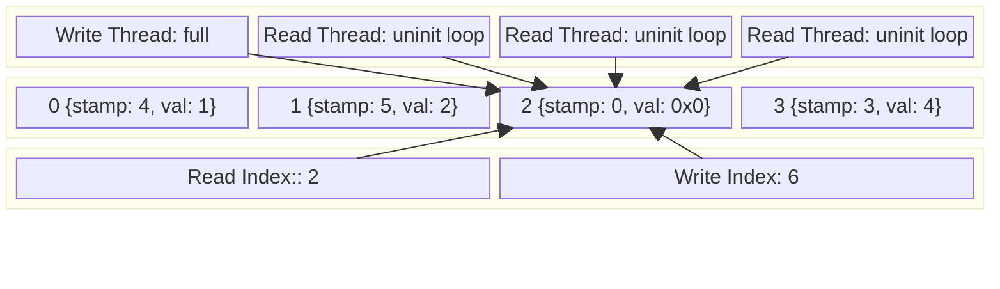

How then, should threads be hardened? It could be a simple retry counter local to the thread, passing off to a fix function. The retry count increases a fixed number of times before attempting a fix. It could also wait for the full check. I dislike waiting on the full check though because it potentially blocks all reads for too long suggesting it'd be better to measure indications of forward progress or the lack thereof.

```rust
let mut retry = (0, idx);
loop {
    if self.buffer[i].stamp.load(Ordering::Acquire) != ridx {
        spin_loop();
		match retry {
		  (cnt, id) if cnt >= 10 && id == idx => self.fix(id),
		  (cnt, id) if id == idx => retry.0 += 1,
		  (cnt, id) => {
		    retry.0 = 0;
		    retry.1 = idx;
		  }
		}
        continue;
    }
}

fn fix(&self, i: usize) {
    let read = self.read_idx.load(Ordering::Acquire);
    if self.buffer[read + 1 % self.capacity].stamp.load() == read + 1 {
	    self.buffer[i].stamp.store(...)
    }
}
```

This shows an idea about what a fix could look like. Filling in the gaps here, would make it possible to self-heal by ignoring the invalid value. If the requirement needed to handle missed states, it would be better to keep a log of all the actions taken to replay it up to a point, as a recovery mechanism. For our use case of a limiter, it's absolutely okay to let something slip in the rare case---a dropped value can still be handled by clients but if we were using it for stronger guarantees in failures, we'd need to do other things.

The fix function here can look at the stamps from the two adjacent positions of the marked index to verify that they deviate from the expected values:
1. pre-position should be equal to either the future uninitialized state or the initialized state when full
	1. $pre_{uninitialized} = present + capacity || pre_{initialized} = present + capacity - 1$
2. post-position should equal its initialized state if the write index is ahead; otherwise, it would equal its uninitialized state
	1. $post_{initialized} = present + capacity + 1 || post_{uninitialized} = present + 2$
This is pretty good but not perfect, since it protects from most cases, but in the even rarer instance that two or more threads crash next to each other, it does nothing. It's possible to handle this case too by looking further ahead or further back and looking at the predicted initialized or uninitialized memory patterns, but we're not going to do that and will call this good. Given that the write failed to update the stamp, it should still be in its former uninitialized state; no other values are possible on a failure. Checking that instead would be more accurate and wouldn't rely on heuristics. In other words, if $index - capacity + 1 = stamp$, then it's a guarantee there was a write issue affecting reads. On the opposite side, a read issue affecting writes would appear as never uninitializing the former value, so it'd be in its former initialized state, which would be $stamp = index - capacity$. These are the two checks that should guarantee correctness; placing them in respective read/write handlers would indicate which respective index to fix. Since these verifications are straightforward checks and only rely on the former state history of reads and writes, there is no chance reads and writes will collide, but there is still a chance same-type threads will.

Is it practical to have the validation check part of the standard process? Removing the retry mechanism and using the basic validation might be a more straight forward approach. On second thought, doing [this](https://github.com/k-cross/limitless/pull/1/changes) reintroduces the ABA problem. A paused but not crashed thread can race. Instead, it could be practical to leave the unblocking up to clients for worst case scenario. Reasoning about the critical section and its failure modes, there are exactly two operations in both the read and write.
- write
	- move bits from stack is panic free
	- atomic operation is panic free
- read
	- raw bit copy is panic free
	- atomic operation is panic free
With these, the only issue to be concerned about is in the case where the OS forcefully signals threads to be killed. Since our only error path is with the operating system killing the threads while in the critical path, it seems like a reasonable tradeoff to expose the client to fix functions in those exceptionally rare circumstances. It's also up to clients to understand this tradeoff and handle signals in the threads more gracefully directly in their programs instead.

After looking on the "network of tubes" for a bit, this is not a true _lock-free_ algorithm and is considered a _blocking_ algorithm. The design is from 2010 by Dmitry Vyukov. A true lock-free algorithm would CAS pointers to data directly instead and, as mentioned before, guarantee progress is made for at least one thread in any instance regardless of preemption. I guess this was considered close enough to being lock-free that it comes up in examples. Another reason is that the performance and thread characteristics are apparently better than a true lock-free algorithm, which is what we're actually after anyway, citing more cache-friendly behavior and no garbage collection from reclamation schemes (epochs/hazard pointers). For reliability, the tradeoff is sufficient, but I think one place where a lock-free algorithm might shine beyond reliability would be in performance spaces with stricter tail latency guarantees.

# Performance Tuning and Analysis
Lastly, the fun part is looking at the computational and memory characteristics of the ring buffer. Since I am using MacOS, I have limited observability into what the hardware is doing with custom tooling but we'll still try to examine what's happening. The most obvious thing to check seems like memory pressure since high contention can cause this to become a highly blocking implementation via its spin loops. 

I want to call out that I am pretty sure we can do better than our current results because other implementations clearly perform _cache padding_, which is adding space between variables so they sit on their own _cache line_, meaning there is no contention across accesses between variables. But in order to understand just how much performance can be gained, it's better to make measurements before trying to optimize so we can all awe in amazement!

The first thing I'd like to try is using the `Instruments` application (not exactly by choice and I wish there was terminal output) in order to take advantage of performance counters in order to get raw stats. MacOS gives us the following to measure _retired_ operations (retired means actually executed, not speculatively executed then thrown away).
- `L1D_CACHE_MISS_LD_NONSPEC` which counts missed loads in L1 cache (both integer and vectorized)
- `INST_INT_LD` which counts all integer based load operations performed
- `INST_SIMD_LD` which counts all floating point and vectorized load operations performed
In order to understand just how many misses represent the total number of load instructions, the following calculation is in order:
$$
\frac{\text{L1 Load Misses}}{\text{Integer Load Operations} + {\text{SIMD Load Operations}}} = \frac{\text{L1 Load Misses}}{\text{Total Load Operations}}
$$
Our actual numbers (after a single run so not statistically averaged) here are:
$$
\frac{239011001}{471024178 + 40723} = 50.74\%
$$
So with the current tests we run, we have a very high miss rate which means there is a lot of contention on the cache! We also find evidence of a little bit of vectorization going on somewhere, but the vast majority is still traditional integer loads.

The second tool we get to use---is DTrace! Actually just kidding, after trying to use DTrace for this particular task, getting access to hardware counters is apparently very limited as Apple gates them heavily, even with SIP is disabled. Now I'm changing my approach:
1. rely on raw performance counters via `Instruments` is the best tool available at the moment
2. analyzing assembly dumps of functions using `cargo asm` tooling
3. benchmarks with `criterion` for good measure

This provides a path forward with the tools available even if they're not necessarily the ones that I wish I had. Point 3 about using `criterion` is less likely to measure anything meaningful for us in this case since it's essentially timing function execution in a loop. It's more of a feeling than a way forward, but still, it's worth exploring to have it in case we want to run similar benchmarks against competing data structures in the future.

Looking further into performance counters[^4] there are two additional discoveries:
- `ATOMIC_OR_EXCLUSIVE_SUCC` and `ATOMIC_OR_EXCLUSIVE_FAIL` are counters that look at `CAS` failures and successes which is perfect
- `FIXED_CYCLES` and `INST_ALL` which are unhalted CPU cycles and all retired CPU instructions executed

$$
\frac{failures}{failures+successes} = contention_{avg}
$$
With actual numbers:
$$
\frac{50024859}{50024859 + 24452925} = 0.6717
$$
With roughly $\frac{2}{3}$ of `CAS` operations ending in failure, it's more evidence suggesting that in highly contentious environments, a lot of fetches end up wasted, resulting in a high probability of a spin loop. The issue with this problem is that even though we spin waiting to get the right timing, the memory pressure builds, increasing the tail latency of operations, which is a huge bummer.

That second set of counters, it's possible to measure instruction throughput generally, but since there are spin loops involved, a high _instruction per clock_ ratio is not necessarily a good thing. For instance: high IPC could mean lots of executing instructions doing nothing. Luckily we have the `spin_loop` hint which signals the CPU to put it in a lower powered state and not run super fast doing nothing. But also, a low IPC can also be bad depending on the case, because it means that the data structure could be blocked or waiting more than it should rather than executing instructions. Unfortunately, it's not possible to count both `INST_ALL` with other `INST_*` instructions, so runs will be isolated against CPU performance and memory pressure but it's still possible to gain insight from separate runs.
$$
\frac{instructions}{cycles} = throughput
$$
With actual numbers:
$$
\frac{2215186356}{72449325730} = 0.0306
$$
Which is low and not very surprising given the memory pressure results. So that leads us to our next tool: looking at the assembly that the code gets broken down to. First, install `cargo-show-asm` with `cargo install cargo-show-asm`, and then we're able to use it, assuming successful compilation. After fighting with this tool to show assembly in target functions, writing a monomorphic wrapper[^5] was necessary so that a concrete _type_ would result in a generated artifact---`usize` was chosen and it looks like:
```rust
#[doc(hidden)]
pub fn __instantiate_ringbuffer_usize_read(rb: &RingBuffer<usize>) {
    let _ = rb.read();
}

#[doc(hidden)]
pub fn __instantiate_ringbuffer_usize_write(rb: &RingBuffer<usize>) {
    let _ = rb.write();
}
```
After this was added it's now possible to get assembly based on the `usize` version of the ring buffer using `cargo asm --release --lib __instantiate --rust`!
```asm
.section __TEXT,__text,regular,pure_instructions
        .globl  limitless::__instantiate_ringbuffer_usize
        .p2align        2
limitless::__instantiate_ringbuffer_usize:
Lfunc_begin0:
                // src/lib.rs:190
                pub fn __instantiate_ringbuffer_usize(rb: &RingBuffer<usize>) {
        .cfi_startproc
        stp x29, x30, [sp, #-16]!
        .cfi_def_cfa_offset 16
        mov x29, sp
        .cfi_def_cfa w29, 16
        .cfi_offset w30, -8
        .cfi_offset w29, -16
        .cfi_remember_state
        b LBB0_2
LBB0_1:
                // ~/.rustup/toolchains/stable-aarch64-apple-darwin/lib/rustlib/src/rust/library/core/src/../../stdarch/crates/core_arch/src/arm_shared/barrier/common.rs:14
                super::isb(super::arg::SY)
        isb
LBB0_2:
                // ~/.rustup/toolchains/stable-aarch64-apple-darwin/lib/rustlib/src/rust/library/core/src/sync/atomic.rs:3905
                Acquire => intrinsics::atomic_load::<T, { AO::Acquire }>(dst),
        ldapur x9, [x0, #24]
        ldapur x10, [x0, #32]
                // src/lib.rs:76
                let i = idx % self.capacity;
        ldr x8, [x0, #16]
        cbz x8, LBB0_9
                // src/lib.rs:77
                if self.empty(idx, widx) {
        cmp x10, x9
        b.eq LBB0_8
        udiv x10, x9, x8
        msub x8, x10, x8, x9
                // src/lib.rs:80
                if self.buffer[i].stamp.load(Ordering::Acquire) != idx {
        ldr x1, [x0, #8]
        cmp x8, x1
        b.hs LBB0_10
        ldr x10, [x0]
        add x10, x10, x8, lsl #4
                // ~/.rustup/toolchains/stable-aarch64-apple-darwin/lib/rustlib/src/rust/library/core/src/sync/atomic.rs:3905
                Acquire => intrinsics::atomic_load::<T, { AO::Acquire }>(dst),
        ldapur x10, [x10, #8]
                // src/lib.rs:80
                if self.buffer[i].stamp.load(Ordering::Acquire) != idx {
        cmp x10, x9
        b.ne LBB0_1
                // ~/.rustup/toolchains/stable-aarch64-apple-darwin/lib/rustlib/src/rust/library/core/src/num/uint_macros.rs:2511
                intrinsics::wrapping_add(self, rhs)
        add x10, x9, #1
                // ~/.rustup/toolchains/stable-aarch64-apple-darwin/lib/rustlib/src/rust/library/core/src/sync/atomic.rs:4072
                intrinsics::atomic_cxchgweak::<T, { AO::AcqRel }, { AO::Relaxed }>(dst, old, new)
        add x11, x0, #24
        mov x12, x9
        casal x12, x10, [x11]
        cmp x12, x9
                // src/lib.rs:91
                if self
        b.ne LBB0_1
                // src/lib.rs:118
                rr = unsafe { self.buffer.get_unchecked(i).data.get().read().assume_init() };
        ldr x9, [x0]
                // ~/.rustup/toolchains/stable-aarch64-apple-darwin/lib/rustlib/src/rust/library/core/src/slice/index.rs:253
                slice_get_unchecked(slice, self)
        add x8, x9, x8, lsl #4
                // src/lib.rs:123
                .store(idx.wrapping_add(self.capacity + 1), Ordering::Release);
        ldr x9, [x0, #16]
                // ~/.rustup/toolchains/stable-aarch64-apple-darwin/lib/rustlib/src/rust/library/core/src/num/uint_macros.rs:2511
                intrinsics::wrapping_add(self, rhs)
        add x9, x9, x10
                // ~/.rustup/toolchains/stable-aarch64-apple-darwin/lib/rustlib/src/rust/library/core/src/sync/atomic.rs:3890
                Release => intrinsics::atomic_store::<T, { AO::Release }>(dst, val),
        stlur x9, [x8, #8]
LBB0_8:
        .cfi_def_cfa wsp, 16
                // src/lib.rs:192
                }
        ldp x29, x30, [sp], #16
        .cfi_def_cfa_offset 0
        .cfi_restore w30
        .cfi_restore w29
        ret
LBB0_9:
        .cfi_restore_state
                // src/lib.rs:76
                let i = idx % self.capacity;
Lloh0:
        adrp x0, l_anon.a11e013164d3a073350a89da043e2603.1@PAGE
Lloh1:
        add x0, x0, l_anon.a11e013164d3a073350a89da043e2603.1@PAGEOFF
        bl core::panicking::panic_const::panic_const_rem_by_zero
LBB0_10:
                // src/lib.rs:80
                if self.buffer[i].stamp.load(Ordering::Acquire) != idx {
Lloh2:
        adrp x2, l_anon.a11e013164d3a073350a89da043e2603.2@PAGE
Lloh3:
        add x2, x2, l_anon.a11e013164d3a073350a89da043e2603.2@PAGEOFF
        mov x0, x8
        bl core::panicking::panic_bounds_check
        .loh AdrpAdd    Lloh0, Lloh1
        .loh AdrpAdd    Lloh2, Lloh3
```

After analyzing the output a bit, I realized what would be a better place to start is looking at how the structure itself is laid out in memory. Maybe it's probably better to look at the `new` function and see how that gets assembled or look at `lldb` again.

```lldb
(lldb) memory read --size 1 --format x --count 64 &self.read_idx
0xac70002a8: 0xcc 0xa2 0x00 0x00 0x00 0x00 0x00 0x00 // read index
0xac70002b0: 0x79 0xad 0x00 0x00 0x00 0x00 0x00 0x00 // write index
0xac70002b8: 0x00 0x00 0x00 0x00 0x00 0x00 0x00 0x00
```
Since `lldb` is basically set up, choosing the right frame to look at where things sit in memory it shows the spacing of values to be $64_{bits}$ apart and we need them to be $128_{bytes}$ apart on Apple Silicon. We definitely have a _false sharing_ situation going on and it's not just between the `write` and `read` indices either, it's also the data.

And for fun, looking at the small assembly generated for `new` when returning `Self`:
```asm
        // src/lib.rs:42
        Self {
str x0, [x19]
dup.2d v0, x8
stur q0, [x19, #8]
stp xzr, xzr, [x19, #24]
.cfi_def_cfa wsp, 32
        // src/lib.rs:193
        }
```

- `str`: is store register which copies data to memory (register -> memory)
- `dup.2d`: duplicates a scalar value to `.2d` two double precision floating point lanes
- `stur`: same as `str` but with an `offset` in this case it's $8_{bytes}$
- `stp`: stores a pair of registers so essentially the same as `str` and it contains a $24_{byte}$ offset
As is shown, there are no `.align` directives and all the offsets are within the same range to include overlap in a _cache line_.

So if we think about our access patterns, what are the things we want isolated for memory reads and writes to avoid contention? The list of variables in the struct:
- buffer which is an array of data in the form of (value, stamp)
- capacity which is essentially a constant read only integer
- read index
- write index

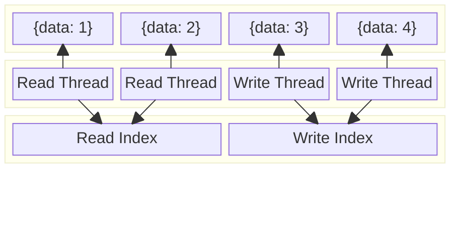

Fixing the read and write indexes to be padded on their own cache lines would solve a lot of contention issues (every read or write thread uses both) but it doesn't necessarily solve false sharing of the buffer itself. Generically, data is read or written by a single thread in its own dedicated slot---memory conflicts can occur if they're stored linearly. The container itself stores pointers to where other values are written in memory so there is at least less concern between contention from read and write index accesses but it still occurs since the initial buffer is the starting point. It is possible to do something about this access pattern if we controlled the _memory allocator_ so that we could potentially stripe data:

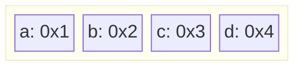

Let's pretend that `0x?` are the memory addresses and a _cache line_ is $2_{bits}$ so that the idea is easier to follow. If we had control of the memory allocator we could devise a strategy where every $n$ elements sit on a unique cache line and then start to fill in the gaps every $n+1$ elements. So for the example above both `a` and `b` share a _cache line_ as do `c` and `d`. Since both reads and writes happen by sequential indexing, every thread is competing for data likely on the same cache line. With the new strategy `a` and `c` would share a cache line while `b` and `d` share one:

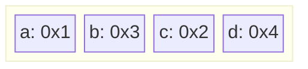
This makes it possible to have fewer false shares but it's also not free. Since each access to a new cache line will fill up the L1 cache faster, there's far more data than what can realistically be operated on causing other issues. It might be worth exploring but we also need to build a custom allocator with a custom array structure for it which is beyond the scope of what I want to accomplish here.

Now we know where we can make some gains, but let's try to make performance experiments are a little more repeatable. Adding `criterion` to the project to setup an easy way to run performance benchmarks and to analyze those binaries with `Instruments` instead of using `main.rs` as the mechanism. Now that it's setup[^6], it's possible to run the binary directly from `Instruments` (`/target/release/deps/benchmarks-*` is the binary's name) which will also give us the hardware counters! The first run (outside of Instruments):
```plaintext
Gnuplot not found, using plotters backend
multi-threaded usize    time:   [18.355 ms 18.491 ms 18.596 ms]
Found 5 outliers among 100 measurements (5.00%)
  4 (4.00%) low severe
  1 (1.00%) low mild
```
Alright, with that in mind let's pad the indices and see if we get any meaningful performance gains. The hypothesis is that memory contention should decrease, IPC should increase, and wall clock time should decrease. But now we need to understand how padding works.

After digging for hours into Rust's RFCs and ecosystem, it seems that there is no straightforward way to pad caches unless you define a struct for it, which is irritating. In other words:
```rust
struct Invalid {
  #[repr(align(128))]
  foo: AtomicUsize,
  #[repr(align(128))]
  bar: AtomicUsize,
}
```
Asking the compiler to do this is not possible at the moment, but we can align the initial struct, which is exactly what `crossbeam` does with its `CachePadded<T>` type. Since it would be reinventing the wheel here and it has already implemented all the traits for multi-threaded coordination, it makes sense to pull in the library with the following changes to the struct:

```rust
pub struct RingBuffer<T> {
  ...
  read_idx: CachePadded<AtomicUsize>,
  write_idx: CachePadded<AtomicUsize>,
}
```
With that done, let's see what the changes in memory and assembly look like!

```asm
        // src/lib.rs:43
stp x0, x8, [x19, #264]
str x8, [x19, #256]
str xzr, [x19]
str xzr, [x19, #128]
.cfi_def_cfa wsp, 32
```
The assembly is showing $128_{byte}$ offsets compared to last time. And `lldb` shows:
```lldb
(lldb) frame variable
(limitless::RingBuffer<unsigned long> *) self = 0x0000000a32c04080
(unsigned long) v = 2
(unsigned long) idx = 43175
(unsigned long) ridx = 37125
(unsigned long) i = 10407
(lldb) memory read --size 1 --format x --count 64 &self.read_idx
0xa32c04080: 0x09 0x91 0x00 0x00 0x00 0x00 0x00 0x00
0xa32c04088: 0xe0 0xb5 0x00 0x00 0x01 0x00 0x00 0x00
0xa32c04090: 0x00 0x00 0x00 0x00 0x00 0x00 0x00 0x00
0xa32c04098: 0xb0 0x8a 0x05 0x00 0x01 0x00 0x00 0x00
0xa32c040a0: 0x00 0x00 0x00 0x00 0x00 0x00 0x00 0x00
0xa32c040a8: 0x00 0x00 0x00 0x00 0x00 0x00 0x00 0x00
0xa32c040b0: 0x20 0x00 0x00 0x60 0x00 0x00 0x00 0x00
0xa32c040b8: 0x01 0x00 0x00 0x00 0x00 0x00 0x00 0x00
(lldb) memory read --size 1 --format x --count 64 &self.write_idx
0xa32c04100: 0xab 0xa8 0x00 0x00 0x00 0x00 0x00 0x00
0xa32c04108: 0x30 0xde 0xdf 0x6f 0x01 0x00 0x00 0x00
0xa32c04110: 0x01 0x00 0x00 0x00 0x00 0x00 0x00 0x00
0xa32c04118: 0x00 0x00 0x00 0x00 0x00 0x00 0x00 0x00
0xa32c04120: 0x00 0x40 0x60 0x6f 0x01 0x00 0x00 0x00
0xa32c04128: 0xe0 0xd2 0xdf 0x6f 0x01 0x00 0x00 0x00
0xa32c04130: 0x80 0x24 0x04 0x00 0x01 0x00 0x00 0x00
0xa32c04138: 0x50 0xd5 0xdf 0x6f 0x01 0x00 0x00 0x00
```

Judging the memory addresses alone, there are gaps wide enough to sit in different cache lines (the other data on other lines are just old junk values which are ignored). And with that we're off to the races.

```plaintext
multi-threaded usize    time:   [12.791 ms 12.859 ms 12.917 ms]
Found 14 outliers among 100 measurements (14.00%)
  6 (6.00%) low severe
  7 (7.00%) low mild
  1 (1.00%) high mild
```

There are more statistical outliers this time but $1 - \frac{12.7_{ms}}{18.3_{ms}} = 0.306$ which is quite a speed boost in wall clock time. Let's see if we're fooling ourselves in reality now looking at the performance counters:
$$
\frac{2210497277}{49090318438} = 0.04503_{IPC}
$$ 
Up from $0.0306$! Then cache miss rate:
$$
\frac{202493048}{648470325 + 62034} = 31.22\%
$$
Which is down from $50.74\%$! And lastly atomics:
$$
\frac{45626725}{23519941 + 45626725} = 0.6599
$$
This looks statistically irrelevant; there's almost no change from the previous numbers ($0.6717$), which is not too surprising. Given that threads are actively changing the values all the time, we run into a similar number of failures. And for fun, adding `CachePadded` to `capacity` and then running a benchmark one last time:
```plaintext
     Running benches/benchmarks.rs (target/release/deps/benchmarks-3003a542ed038bf9)
Gnuplot not found, using plotters backend
multi-threaded usize    time:   [12.712 ms 12.805 ms 12.878 ms]
                        change: [−1.4995% −0.8090% −0.1325%] (p = 0.02 < 0.05)
                        Change within noise threshold.
Found 10 outliers among 100 measurements (10.00%)
  5 (5.00%) low severe
  5 (5.00%) low mild
```
There's very little change but it is an improvement with minimal impact so we'll keep it. The very last thing we could check on this data structure before just cleaning up code, would be how something like `buffer: [CachePadded<Slot<T>>]` changes. Beyond this, additional improvements would have to be done by analyzing the assembly and looking at how to micro-optimize specific layouts but that becomes architecture dependent, even more than now. Before we begin the last phase, let's have a [marker](https://github.com/k-cross/limitless/commit/621c892820e5f2156f45ae0848fac83483f805eb) for the progress so far.

After making changes to the `buffer` the following results are in:
```plaintext
     Running benches/benchmarks.rs (target/release/deps/benchmarks-3003a542ed038bf9)
Gnuplot not found, using plotters backend
multi-threaded usize    time:   [12.424 ms 12.602 ms 12.765 ms]
                        change: [−3.1059% −1.5855% −0.1154%] (p = 0.04 < 0.05)
                        Change within noise threshold.
Found 4 outliers among 100 measurements (4.00%)
  2 (2.00%) low severe
  2 (2.00%) low mild

```
$$
\frac{cache_{miss}}{cache_{total}} = \frac{144601750}{564245438 + 61966} = 0.2562
$$
$$
\frac{atomic_{failure}}{atomic_{total}} = \frac{35728704}{22024890 + 35728704} = 0.6186
$$
$$
\frac{1815145679_{instructions}}{36048137356_{cycles}} = 0.0504_{IPC}
$$
In terms of raw performance, the results are mixed. The cache miss rate is down to $25\%$ from $31\%$ and the IPC is up from $0.045$ to $0.05$. Atomics is also minimally lower from $0.65$ to $0.61$ which if not noise is likely due to less cache issues across cores.

And lastly comparing the two lines from top the first being cache padding added to the buffer and the second without:
```plaintext
PID   COMMAND   %CPU  TIME     #TH #WQ #PORTS MEM    PURG CMPRS STATE
54850 limitless 663.7 01:04.09 8/8 0   18+    3456K+ 0B   0B    running
54621 limitless 670.1 08:21.47 5/4 0   15+    1632K+ 0B   0B    running
```
The memory used (not a fake number) is more than double that of the non-padded buffer. This makes sense given that we're only using `usize` in this test. Where it probably makes sense to use a padded cache to make a difference is when the objects being stored in the array are already large. The padded cache putting new elements on their own cache lines would then be much more negligible in those cases.

Finally, let's get some performance gains classically, looking at code and seeing if there is anything that immediately stands out that could be improved or is adding unnecessary overhead. The first thing that stands out are the `break` statements; they're at the bottom of the functions, which can be converted to `return` statements. The second thing that stands out is the `let i = idx % capacity` calculation to get an index into the array. If it's possible to calculate `i` without a modulus, it would almost certainly speed things up since that's generating the `udiv` assembly instruction which can execute in anywhere from 2 to 34 CPU cycles. One possible approach would be to manipulate bits instead so that it's possible to get an index via bitwise operations. Let's say something like `capacity - 1 = 0b00000111`; then maybe it's possible to be clever here assuming multiples of two. Lastly, there is the `wrapping_add()`, which is more logic than a regular add. If it's possible to get rid of these, the resulting assembly likely gets reduced too. The first part was easy; the second part requires some thought:

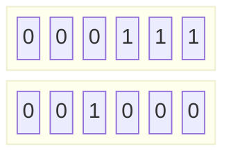
The diagram shows that if we have $7$ in binary or `111`, then the entire range of values can be encapsulated by a binary $8$ or `0b1000`. If, every time capacity is reached, we ignore all the values in between and simply shift the _furthest reaching bit_ (FRB) over by 1. For example, let's say we are at index 6 (capacity = 7); next we would want to wrap to zero and shift the FRB by one, which would look like 8:


Doing it again would go to 16:

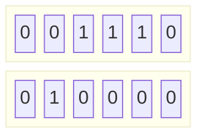

This would allow us to increment the stamp and do bitwise operations to get the index, all of which are computationally fast but it does mean things wrap quicker. Let's call the bit position representing all the values the _max capacity bit_ or MCB such that `mcb = capacity.next_power_of_two()`
- calculating the buffer index: $(MCB - 1) \land stamp \implies index$
- calculating the write index/stamp from a read:
	- $index' = index + 1 : index' < capacity$
	- $index' = 0 : index + 1 \geq capacity$
	- shift the furthest reaching bit: $((MCB \land stamp) \ll 1) \lor index' + 1 = stamp'$
- calculating the read index/stamp from a write:
	- $stamp = index$
This changes how the read and write indices work at a fundamental level, again:
```rust
// getting index
let idx = self.read_idx.load(Acquire);
// calculate array index
let i = (self.mcb - 1) & idx;
// get unrepresentable bits ex/ 0b11111110000
let end = usize::MAX ^ (self.mcb - 1);
let new_idx = if i + 1 >= self.capacity {
    (idx & end) ^ end
} else {
    idx + 1
}
let write_stamp = idx ^ end
```
The blurb above shows that it's easier to use a bit indicating a loop happened by changing its state via an `xor` to turn it on or off. In other words, `mcb ^ index` is a pretty good way to get a new index/stamp.

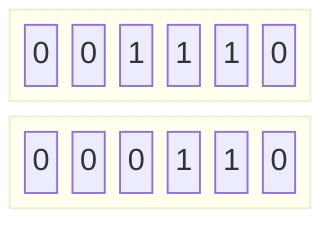
The next loop hitting the same index/stamp would simply flip the same bit again like so:


This looks easier to reason about and generally less complicated. There doesn't seem to be any tradeoff we'd care about, so it appears to be a winning strategy. Even if there are more total operations in assembly, it is quite likely to use fewer CPU cycles because we're removing `udiv` chained with `msub` to get the modulo: $remainder = dividend - (quotient \times divisor)$. 

Adding another _benchmark_ to compare how our ring buffer ranks against _crossbeam_ would also be fun. Before the changes were made to remove the `modulus` and `wrapping_add` operations, the benchmarks were (I forgot to record the benchmark output from console, but you can choose to run them yourself based on git history if you want evidence) between $12\text{ms}$ and $13\text{ms}$ for ours and between $5.2\text{ms}$ and $5.8\text{ms}$ for crossbeam's `ArrayQueue`. 

With the changes in place and running the new benchmark, it's now faster than the crossbeam implementation of `ArrayQueue`! I expected to be relatively similar with `crossbeam`, but the results make sense given we do a little bit less work. It's also worth noting that `crossbeam` implements a lot more traits, but we're not making use of them, so it's doubtful to have measurable performance impacts for this particular benchmark.

```plaintext
     Running benches/benchmarks.rs (target/release/deps/benchmarks-3003a542ed038bf9)
Gnuplot not found, using plotters backend
Native vs Crossbeam/multi-threaded usize/20
                        time:   [2.6658 ms 2.7429 ms 2.8230 ms]
                        change: [−79.129% −78.541% −77.925%] (p = 0.00 < 0.05)
                        Performance has improved.
Found 5 outliers among 100 measurements (5.00%)
  5 (5.00%) high mild
Native vs Crossbeam/crossbeam usize/20
                        time:   [5.2326 ms 5.2630 ms 5.2941 ms]
                        change: [+0.8882% +1.7374% +2.5564%] (p = 0.00 < 0.05)
                        Change within noise threshold.
Found 1 outliers among 100 measurements (1.00%)
  1 (1.00%) high mild
Native vs Crossbeam/multi-threaded usize/21
                        time:   [2.8023 ms 2.9049 ms 3.0143 ms]
                        change: [−78.528% −77.727% −76.839%] (p = 0.00 < 0.05)
                        Performance has improved.
Found 3 outliers among 100 measurements (3.00%)
  2 (2.00%) high mild
  1 (1.00%) high severe
Native vs Crossbeam/crossbeam usize/21
                        time:   [5.2229 ms 5.2519 ms 5.2807 ms]
                        change: [+0.5401% +1.3114% +2.0551%] (p = 0.00 < 0.05)
                        Change within noise threshold.
Found 2 outliers among 100 measurements (2.00%)
  1 (1.00%) low mild
  1 (1.00%) high mild
```

$$
\frac{51484046_{LDmisses}}{(299365679 + 60189)_{LDinstructions}} = 0.1719
$$

$$
\frac{15262434_{atomicFailures}}{15262434+13277182} = 0.5348
$$

$$
\frac{1111431541}{13248172588} = 0.0838_{IPC}
$$

The last analysis shows that the cache miss rate dropped from $31\%$ to $17\%$ and the atomic failure rate also dropped quite a bit from roughly $65\%$ to $53\%$. The IPC also increased to $0.083$ operations from $0.045$, which is around double in a highly contentious environment. Looking directly at the criterion reports, I can see that the aggregated statistics show tail latency to hit around $5\text{ms}$, which is about twice the length of a normal operation. In the next post, we'll go in more depth on tail latency, which `dtrace` can actually help with because we can instrument the code directly with USDT probes. This one is long enough, and we're pretty much done with this data structure.


[^1]: [Loom](https://docs.rs/loom/latest/loom/)
[^2]: [Basis of Loom](https://dl.acm.org/doi/epdf/10.1145/2544173.2509514)
[^3]: [Loom Tunables](https://docs.rs/loom/latest/loom/model/struct.Builder.html)
[^4]: [Apple Silicon CPU Optimization Guide](https://developer.apple.com/download/apple-silicon-cpu-optimization-guide/)
[^5]: [Monomorphic Wrapper](https://rustc-dev-guide.rust-lang.org/backend/monomorph.html)
[^6]: [Criterion Setup](https://criterion-rs.github.io/book/getting_started.html)