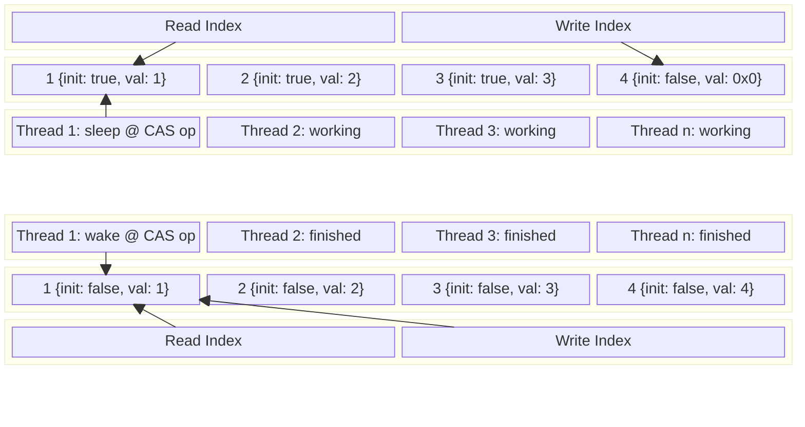
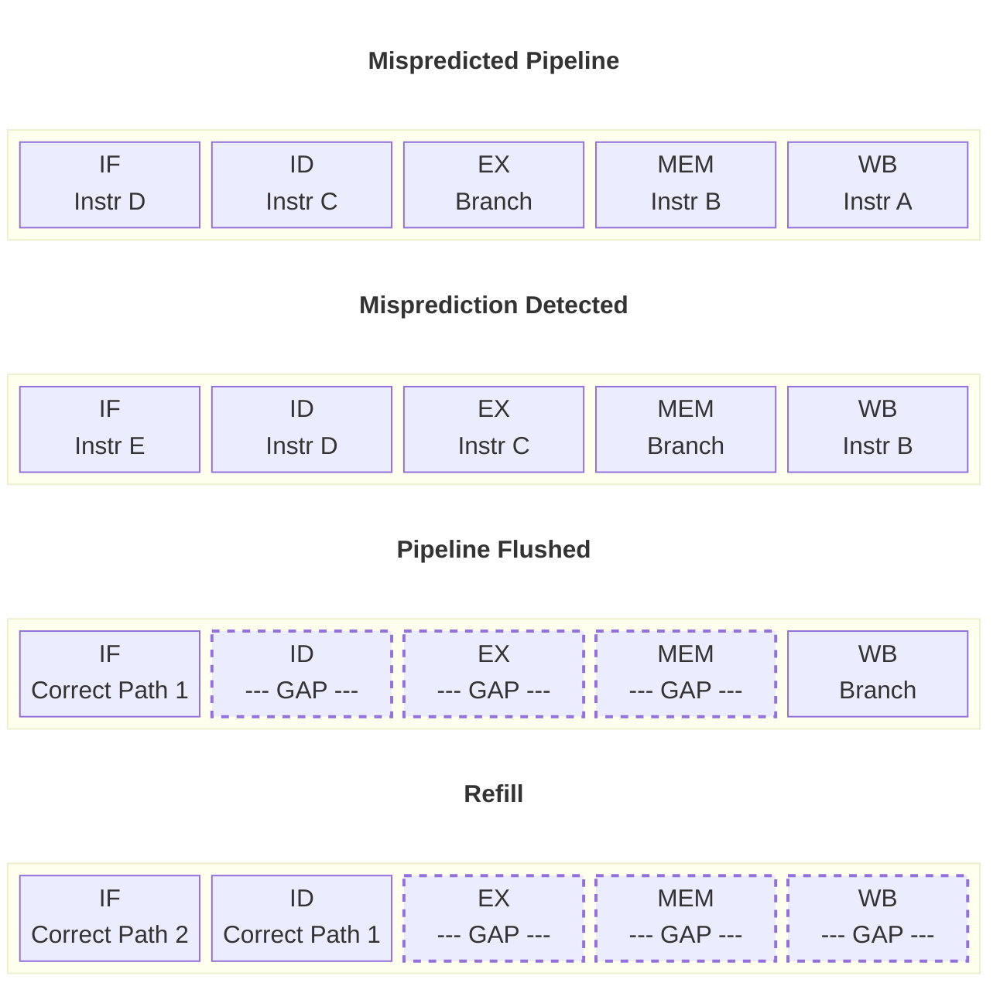
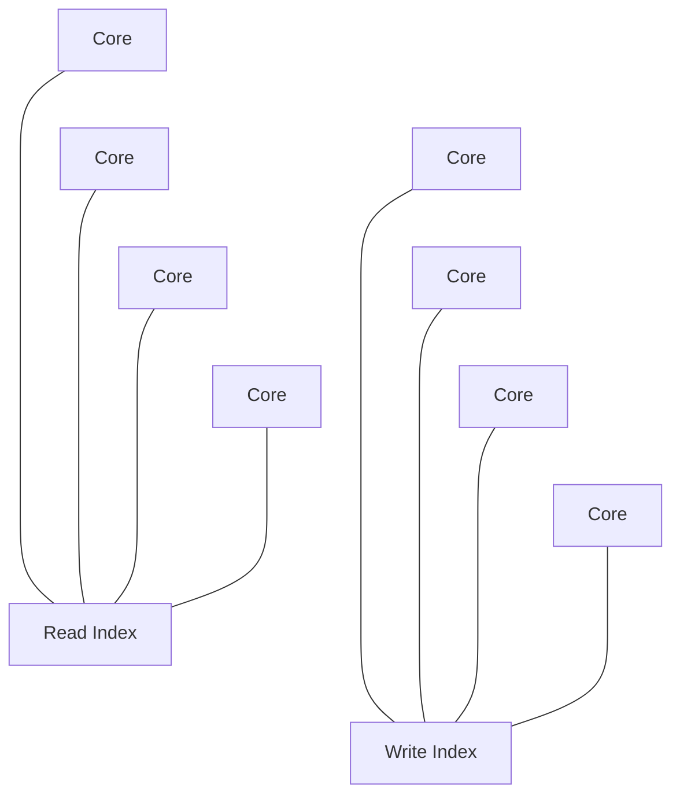

This post is focused on improving performance and measuring the tail latency of the _read_ and _write_ operations of the lockless implementation of a bounded MPMC ring buffer. That said, this entry will be structured differently than the last[^1]; rather than reading like detective notes, it will compare the initial naive implementation with the final result and leave out the parts where I'm still figuring things out, in an effort to create an artifact that reads more coherently. The writing is not generated by AI and if any code is, it's called out.

# Clarifying Changes

I wanted to take a moment to walk through the core changes from the original naive implementation to the most recent[^1] to clarify how things work and what the problems were along the way.

The first core change was relatively obvious, removing the `size` variable from the array to remove race conditions on the indices. This created a new problem, where the index calculations for _full_ and _empty_ could become ambiguous states:

```rust
let capacity = 10;
let ridx = 0; // read index
let widx = 0; // write index
```

The question was clearing up whether or not the above meant _empty_, or whether `widx` had already wrapped around making it _full_; the wasted slot solution where _empty_ was equality and full was when `widx + 1 == ridx` was what followed, also including a flag marking whether or not the particular space in the buffer was ready for a read or write, preventing race conditions. This got rid of _some_ ambiguity but not all:

```rust
Slot {
  initialization: AtomicBoolean,
  data: ...
}
```

This made it possible for the ABA problem to occur:



As shown above, in the case of multiple read threads, it was possible to put a thread to sleep after checking its initialization state (Thread 1 in the above example). If it were to sleep long enough, represented by the upper portion of the example, for a full loop to have occurred only to wake up before a write happened to reinitialize it, the bottom portion of the example, it would have been able to read uninitialized data. The fix here was to add more information to the initialization state in the form of a _stamp_, removing the remaining ambiguity. This was done ultimately by marking a single bit on the index to indicate whether or not it wrapped; the _stamp_ was responsible for marking the space a _read_ or _write_, encoding the proper state as well as when it could be used. As an example:

```rust
0b101 == 5 // capacity
0b1000 == 8 // next power of two aka mbc
0b0101 // read index at capacity
0b1101 // read index at capacity on another loop
```

Every lap performs an `xor` operation against the `index` and `mbc` to flip the bit at the non-counting position. By doing this, it encodes whether or not a lap had occurred so that the stamp could initialize the state for the next operation and the index would be protected from a local value where the counter was in the right position but a lap had occurred, removing all ambiguity.

# Branchless Index Computation

The actual indexing strategy is solid but it can be computed efficiently in all branching cases. We left the last post with a conditional statement checking whether or not the Ring Buffer had reached its capacity before deciding to wrap back to zero. That same calculation can be performed in a _branchless_ manner such that the conditional check is a series of math operations; this matters because a computer will do _pre-work_ in loading a set of instructions to be ready to execute but in order for it to work best it needs to load the right set of operations. Conditional branches can upset this balance by making the CPU _guess_ which branch is more likely to execute then fill up its execution pipeline with _those_ instructions. When it guesses wrong, the CPU throws out its pipeline of instructions and has to refill them which costs cycles. A branchless computation performs tricks to remove branch instructions such that a conditional, in either case, performs the same computation even though the result may be different. For example:
- IF (Instruction Fetch) - get opcode from PC (program counter)
- ID (Instruction Decode) - prepare register file for execution
- EX (Execute) - execute opcode
- MEM (Memory Access) - perform memory load/store operations as required
- WB (Write Back) - update internal registers



Since a misprediction happens every $\frac{1}{n}$ operations the impact is felt more frequently when $n$ is small, so it's possible to argue this change is not very meaningful; it does increase _tail latency_ though, which is the more famous issue with this particular style of ring buffer. In order to resolve it, the conditional check `if i + 1 >= self.capacity {0 and flip bit} else {index + 1}` needs to become branchless. Here's how it's done:

```rust
let idx = self.read_idx.load(Ordering::Acquire);
let mcb = (self.capacity + 1).next_power_of_two();
// mask the lower bits responsible for the counter
let i = idx & (mcb - 1);

// save true or false to 0 or 1 in branchless computation
let at_capacity = (i + 1 >= self.capacity) as usize;
let new_idx = ((idx + 1) & at_capacity.wrapping_sub(1))
    | (at_capacity * ((idx & mcb) ^ mcb));
```
1. save the result of the conditional operation as an integer
2. perform the `wrapping_sub` on the result
	1. when we've reached capacity the result is $1 - 1 = 0$ which paired with the logical _and_ operation flips all the `idx` bits to zero resulting in: `0 | (at_capacity * ((idx & mcb) ^ mcb))`
		1. since `at_capacity` is $1$ it lets `mcb & idx` set all the counter bits back to $0$ then set the lapping bit with the `xor` operation pairing it with the logical `or` at the end
		2. the total result here is either $0$ or $mcb$ based on pure math alone
	2. when capacity is not reached the result is $0 - 1 = MAX_{usize}$ which is binary for `0b111111111...` so the first part results in `(idx + 1)` the second part becomes $0 \times x = 0$ and so `(idx + 1) | 0` is just `idx + 1`

In both cases the same exact math is used to determine the result of the index which means no branch predictions in the CPU pipeline which can cause gaps in execution.

I didn't have the foresight to add USDT probes to measure _tail latency_ before I implemented the change but moving forward they'll be included.

# Adding USDT Probes

Since I am running on Apple Silicon, I can use DTrace to measure _tail latency_ with USDT probes but they will also work with tools like `perf` and `ebpf` in the Linux ecosystem. Next is defining the probes and then placing them in the right locations. This brings up the question, how much overhead is there to the probes? To my understanding, negligible amounts!

The probes when turned off are essentially `nop` instructions which are so cheap they're effectively meaningless. This is paired with some metadata that names the probes so when the probes are turned on, the `nop` instructions act as locations for DTrace to inject a breakpoint while running its script. This happens via `atomic` instructions which are fast and safe. This is the limit to my understanding but when the DTrace script quits running it sets the injected instruction back to a `nop`.  If you are worried about performance costs of DTrace, it is possible to use it without injecting probes into your program using almost the same method I describe below, but it requires that you know the name of your function and get its entry and exit points which change dynamically in rust. For me running `sudo dtrace -ln 'pid$target:::entry' -c './target/release/limitless'` results in:

```plaintext
...
659944   pid20512         limitless limitless::RingBuffer$LT$T$GT$::read::h1e77ee054a38d049 entry
659945   pid20512         limitless limitless::RingBuffer$LT$T$GT$::write::hdc9e78a6b8c28aaf entry
...
```

I will not use those and instead create deterministically named probes at the exact points measurement is desired (which are probably the same tbh):

```rust
#[usdt::provider]
mod limitless_probes {
    fn read__start(_: &usdt::UniqueId, idx: u64) {}
    fn read__done(_: &usdt::UniqueId, idx: u64, ok: u8) {}
    fn write__start(_: &usdt::UniqueId, idx: u64) {}
    fn write__done(_: &usdt::UniqueId, idx: u64, ok: u8) {}
}
```

The first step is defining the providers, which I think of as probe data types with names, using the `usdt` library's macro. Next is placing the probes at the _read_ and _write_ functions' entry and return points.

```rust
let probe_id = usdt::UniqueId::new();
limitless_probes::read__start!(|| &probe_id);
```

This is placed at the function's entry site which defines a new `probe_id` letting DTrace know it's an event that should be tied to that ID.

```rust
limitless_probes::read__done!(|| (&probe_id, i as u64, 0u8));
```

This is set right before returning, tracking the same `probe_id` as the start to tie the events together. It then records `i` which is the index that was used in the `buffer`, and the `0` here indicates that we're on the _error_ path whereas the `1` used before the other return call indicates the success path. The same exact setup is done for the writes.

Lastly, the library sets it up to export the module for use in the main binary so anyone can use the probes without needing to add the `usdt` crate as a dependency:

```rust
// lib.rs
pub use usdt::register_probes;

// main.rs
fn main() {
	// top of main
    limitless::register_probes().expect("failed to register USDT probes");
}
```

The script to measure tail latency bundles both error and success paths:

```d
  limitless_probes*:::read-start { 
      self->read_ts = timestamp; 
  }
  
  limitless_probes*:::read-done /self->read_ts/ {
      @read_lat = quantize(timestamp - self->read_ts);
      self->read_ts = 0;
  }

  limitless_probes*:::write-start { 
      self->write_ts = timestamp; 
  }
  
  limitless_probes*:::write-done /self->write_ts/ {
      @write_lat = quantize(timestamp - self->write_ts);
      self->write_ts = 0;
  }
```

Not being an expert with DTrace I used AI to help generate the script. The `self->read_ts` is basically a variable where the `self` bit makes it thread safe by making it local to the thread then each one is assigned a monotonic timestamp. The `read-done` side is checking that `self->read_ts` is not `0` and then performs the `quantize` function which is bucketing individual results by a power of two in `@read_lat` before resetting the local variable back to zero. The same exact thing is done for the _writes_ and the end result when run is a histogram like the following:

```sh
sudo dtrace -c ./target/release/limitless -s tail_latency.d
```

```plaintext
 value  ------------- Distribution ------------- count
    64 |                                         0
   128 |                                         25
   256 |@@@@@@@@@@@@@@@@@@@@@@@@@@@@@            17932
   512 |@@@@@@@@                                 4943
  1024 |@@@                                      1818
  2048 |                                         2
  4096 |                                         3
  8192 |                                         1
 16384 |                                         3
 32768 |                                         0


 value  ------------- Distribution ------------- count
    64 |                                         0
   128 |                                         2
   256 |@@@@@@@@@                                2950
   512 |@@@@@@@@@@@@@@@@@@@@@@@@                 8316
  1024 |@@@@@@@                                  2510
  2048 |                                         3
  4096 |                                         2
  8192 |                                         2
 16384 |                                         0
 32768 |                                         2
 65536 |                                         0
131072 |                                         1
262144 |                                         0
```

The one on top shows the `read` distribution and the one below is the `write` distribution. The `value` is which timestamp bucket it fell in, recorded in nanoseconds. This is great because it's showing the outliers which is what tail latency is all about, the tail of the distribution. The reads mostly operate within $256\text{ns}$ and writes fall largely in $512\text{ns}$ which does not look too surprising. However, the outliers show reads at $16.38\mu s$ and writes at $131.07\mu s$ which tell the story.

$$
\frac{16384}{256}=64_{\text{read tail latency}}
$$
$$
\frac{131072}{512}=256_{\text{write tail latency}}
$$

The read tail latency is $64\times$ worse than where it fits in the distribution and the write tail latency is worse by $256\times$. The reason to use USDT probes and DTrace is that it's measuring the release build's tail latency and can be toggled at anytime without affecting the program's normal running state[^2]. It can be distributed to anyone this way which means the library can be instrumented seamlessly into anyone's production builds if they wish to gain access to the probes for measuring them against their workloads.

This is a good mechanism to look at tail latency but the results above don't paint a complete picture. For one, it's measuring a specific workload (4 read 4 write threads) for a specific architecture. Second, it's just a single run and really should be performed multiple times to get statistical relevance. Lastly, given our knowledge that this is a _lockless_ and not a _lock free_ data structure, the tail latency is technically unbounded---the OS could sleep a thread that others are waiting on and spin wait indefinitely. There is no guarantee that any thread could make forward progress. That said, it is still better to understand the general characteristics of a system's performance given what kind of workload it will operate under and the tail latency script gives anyone a mechanism to do that[^3]. If having a bound tail latency is a strict requirement, then a different implementation is needed.

Running the _criterion_ benchmarks, it shows a very modest regression which indicates that the probes are worth the cost!

# Adding Backoff

After adding the `Backoff` mechanism from `crossbeam`, both libraries have effectively the same performance and latency on the same benchmark now. The backoff is useful because it prevents false sharing storms as core counts increase and contention grows. With respect to multi-threading, we've essentially hit our limits for work happening in parallel with this implementation. Higher core counts will increase contention resulting in higher latencies particularly at the tail. This makes intuitive sense:



# Updating Loom

The last thing I'd like to do before moving on is to update the `loom` tests. Last post spent a good amount of time learning how to run and understand `loom` where we ran into the problem of it running endlessly. I'd like to modify the tests to specifically check three different combinations that all use two threads instead of three, to significantly cut down on the combination of testable conditions:

1. a _read/write_ test which starts empty
2. a _write/write_ test which starts empty
3. a _read/read_ test which starts full


# What's Next

After this implementation, I hope it is very clear why you would want different implementations for different purposes. The limitation on this lockless MPMC bounded ring buffer is that it only scales with threads so far until it becomes a contention nightmare.

An SPSC buffer can perform even faster reads and writes by optimizing a couple things:
1. pinning to specific CPU cores so that caches are maintained and hot
2. removing index checks since there is only ever one other thread

Since there is no contention it removes issues with tail latency but it sacrifices throughput. So we'll either explore this next but more likely we'll move onto a lock-free version. Thanks for reading!

[^1]: [part one](https://k-cross.github.io/limits1/) of the MPMC Ring Buffer implementation
[^2]: dtrace and [USDT probes](https://illumos.org/books/dtrace/chp-usdt.html#chp-usdt)
[^3]: instrumented USDT probe [diff](https://github.com/k-cross/limitless/commit/f857c27db6c541dd8e1393dfdfa99844d75e14bb)
