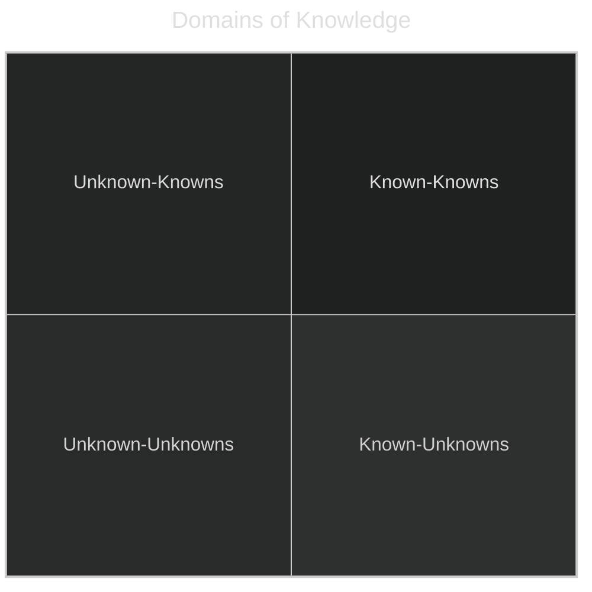
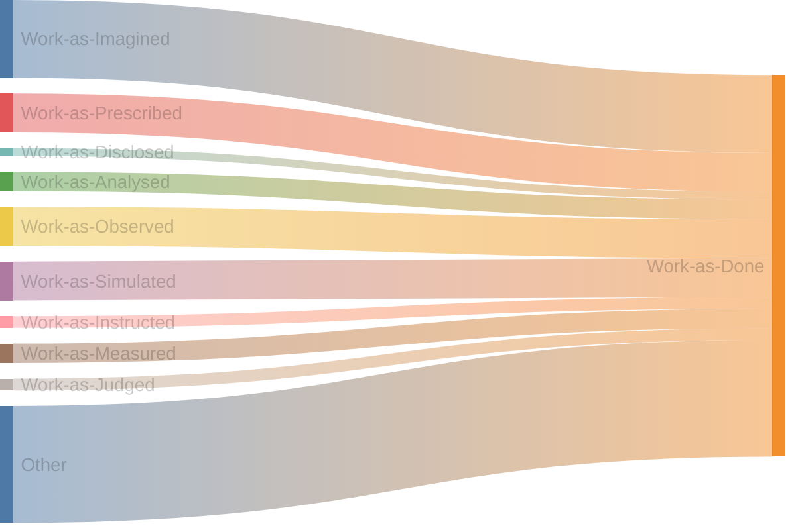

Chances are you have experienced working with someone that devours joy in anything at some point. It's easy to avoid their foulness except when they hold direct authority over you. Worst is when an entire organization is rancid, injecting its venomous tendencies into everything, where the only solace are on the disjoint and dotted lines in org. charts. Leaders that are indifferent on culture issues because they're viewed as not moving the needle for business objectives, will eventually corrode their workplace and will not move the needle on business objectives.

_Note: does not focus on intentional sabotage to promote attrition._

## HAZMAT Protection Level A Required

What makes a work environment toxic? A lot of things, but here are some specific examples from personal experience.

### Knowledge Differentials

Unnecessary discretion and keeping secrets will destroy trust. Yes, it is possible that this is a job requirement because you work for the government on classified materials---this does not apply to you. In order to work effectively in that kind of environment, you have to assume that people are acting with good faith. For everyone else, a lack of transparency will:

- slow down decision making
- create misaligned incentives by weaponizing knowledge
- reduce learning opportunities
- erode trust

Transparency comes in two varieties, active and passive. Passive transparency might be worse than being fully opaque because it's pretending to do something it's not by giving anyone a valid claim to say they're being transparent when they share _any_ information. Passive transparency is when information is available, but only after a person has explicitly requested it. It does not sound sinister, but it is easy to weaponize by creating knowledge gaps by withholding information.

Opaque and passively transparent groups unnecessarily add to quadrant 3 in the chart above; anyone that does not know what questions to ask, where to find information, or even the existence of information, will not find it. Unknown-unknowns only move to quadrant 1 or 4 through accidental discovery or explicit action to learn something. Leaders in passively transparent and opaque organizations intentionally control the flow of information, the only difference between the two is the level of explicitness. Knowledge differentials are weaponized by holding information hostage during meetings to look better in front of peers. It's used to avoid pesky questions and stay in control. All so that someone can fluff up their performance review stats and politic their way up the food chain.

By contrast, active transparency is going out of the way to share information, making it easy to access and find. This promotes better environmental conditions because it significantly reduces knowledge differentials, allowing for more insightful collaboration. Knowledge differentials is a form of office politics. Withholding information to gain advantage, whether in public through something like perceived competence, or information leading to more effective work output. Holding knowledge hostage should be avoided. It slows decisions down considerably and creates a zero-sum game type culture, internal to the company.

### Process Tycoons

Prioritizing processes over people is the pathology and a lot of companies are breaking the first two rules of venture club:

<!-- \$\$
\text{A process that works does not make it good, make processes good.}
[Math]-->

<!-- \$\$
\text{A process that works does not make it good, make processes good.}
[Math]-->

Speaking from the engineering side---poor processes lead to bizarre failure modes. Ones where written processes work most of the time have failure modes that result in updates to add more process to account for those failure modes. A death spiral to avoid!

I once worked in an organization that had a SDLC (software development life-cycle) that was 13 pages long; it contained no diagrams---a real wall of bulleted text. Engineers would routinely fail to follow all the steps in the SDLC because the document was doing too much. It acted as a kind of bastard runbook of runbooks but in particular, the release portion was a major issue. After the _verifications_ were considered complete in a _non-prod_ environment, people could YOLO deploy and there were not automated processes in place to see if production was burning. The same failure mode occurred on multiple occasions, and during the incident review meetings after pointing out these issues, things changed for the worse---the document gets a new extension. There were many pathologies at this organization but the process bits were clear. The SDLC and its runbooks were ineffective when considering the whole system---the people that did the work and how work was actually being done. The SDLC and the runbooks needed to be different documents and removing excessive manual toil should have been prioritized to increase whole system resilience.

Another process issue that can creep in and becomes more nuanced is requiring group consensus to do every. single. work. item! In software engineering, coming across _agile_ is almost a certainty at some point. It's practiced in different ways, in different places, with different meanings, and styles. [Scrum](<https://en.wikipedia.org/wiki/Scrum_(software_development)>) is probably the most common methodology for product teams.

Scrum can be weaponized against teams though. Story planning and grooming are mechanisms for work to be put into some queue. Story planning can devolve into meetings that bake a prescriptive solution into the ticket. There's nothing wrong with giving people direction or guidance when needed but when the entire team sits around, arm chairing solutions, it's not productive for granular work. Breaking down big projects--creating coherent design strategies but the minutiae of every day work should be left to engineers to solve; this is their job. The high level description of the job to be done and the exit criteria is sufficient. _Grooming_ on the other hand, is assigning some value of work to tickets describing something about the difficulty of the ticket. The next way to weaponize scrum is to require all work and tickets in a sprint flow through this type of workflow. If strict about the work done on a ticket, this means that any improvements will be isolated from that work and moved into a new ticket, by which must now be defined in a story, pulled into a sprint, and groomed. Everything follows this flow, which makes quality of life improvements very difficult to pull off or justify, because there is a gate keeper deciding what tickets to pull in and when for each sprint. I've yet to see a manager that actually set aside [Math]of _some unit of time_ to make meaningful improvements when they make the scrum processes this strict. This sucks the joy out of work. Improvements that one person would like to make are not the same improvements as another. Different things may bother different people and therefore prioritized differently.

This is a case where process forgets the people. There was no flexibility in the process which made it hard to improve anything without breaking the rules. But there were so many other rules to prevent deviating that nothing beyond what was prescribed got done which meant no QoL improvements. This approach is slow and cumbersome at best and destructive at worst. It's fine to track work, but it's also beneficial to be flexible with how work gets accomplished. Risky operations should contain guardrails of some sort, beyond that, let people be creative, get out of their way and let them work!

Process pathologies seem to result from differences in _work-as-imagined_ vs. _work-as-done_. If unfamiliar with the concept, [Steven Shorrock](https://humanisticsystems.com/2016/12/05/the-varieties-of-human-work/) has a great book and blog post on this. Essentially, how work actually gets done is different than how work is thought of or expressed in a variety of ways. This loosely shows the relationship between the proxies for viewing work and how close it relates to the action:

### We Value Your Feedback--LOL

Actionable feedback is incredible, it gives the receiver a valuable piece of information that allows them to improve should they choose to align with it. People and organisations that choose inaction or punishment will stop receiving it. The message being sent is clear; there are top-down directives from a hierarchal order of authority to follow.

For example, I remember having a one-on-one with a former manager and that meeting ended up being yet another work synchronization meeting. This was essentially discussing the same topics as other public team meetings (of which there were three), and was held for a hour at a weekly cadence. I said that I don't get value out of the one-on-ones and would rather have a half hour meeting every two weeks instead, since I could never get the topics to shift and was already used to that cadence coming from a different team.

Instead of having a conversation about how to make these meetings a more valuable use of time or shifting cadence, I was passively denied, no change was ever made but I did get a new weekly meeting added to my calendar to synchronize more of the same work items discussed in three other public meetings. Perhaps I was a bad communicator? Perhaps my work wasn't broken down enough? I'll never know since it was never discussed. However, my feedback went both ignored and punished.

If you're not high up on the food chain, there's no solution here, cut your losses. If you are an influential leader, it is still difficult to break bad cultural norms once they're established without intentionality and support from other leaders.

### One of Us

Treating individuals differently. To some degree this is inevitable, but wildly different behaviors for different people in similar roles is absolutely unacceptable. For instance, allowing one person to deviate from a process because they fit in or are liked more than another. Rules and processes need to apply equally to everyone, otherwise favorites automatically become more effective giving them unfair advantage along multiple axis. Is the person a 10x engineer because they're really that good or because they're empowered where other people are not? This matters because it's possible to make an entire team of people more effective rather than a single individual, by adjusting those nepotism dials.

How people are treated matters. Being gaslit into nice perks for mental health is not the same as having the psychological safety to speak your mind and improve working conditions. Being accepted by colleagues needs to happen or relationships break down and the politics begin.

For example, one org had their people promoted to the highest positions based on length of tenure, instead of proven credentials. My first month on a new team, I asked the sole staff engineer for an overview of the product's architecture. This team was small. One concern I brought up was about signed integer ID values in a MySQL database, noticing it had a legacy PHP application still in tact. The staff engineer immediately said they don't have any signed integer IDs so I shouldn't worry about it. Then when doing performance testing and running into issues with the database, I ended up analyzing the schemas. Sure enough, it was a mixture of a lot of stuff but in it, were the signed integer values.... It was in that moment that I knew I could not trust the technical leadership. They could build things, but no one actually did more than read stack overflow to get answers to their questions without doing the hard work of understanding how anything actually worked. It's a brutal assumption that mostly ended up being correct. The problem is that when unqualified people become technical leaders, it diminishes the real work being done by people who deserve to be recognized. Eventually someone will notice and it will be a problem for the organization.

## Root of Trust

Toxic work environments rot trust at the root. Trust is the foundation of all positive human relationships. When that erodes, growing it back is hard. Sometimes businesses need to make hard decisions that will affect morale, but they don't need to affect trust.

It's hard to learn in toxic environments. Even valid criticism can be more difficult to take seriously, because your guard is always up, making it more difficult to have conversations about improvement. Everyone is trying to smell the weakness in each other and for this reason, I say leave---it's not worth it to be in a toxic environment nor to try and fix one. It will slow your progress and eliminate any joy left in work. I am fully aware that it's not always possible to leave and to be stuck for a whole variety of reasons, I've been there, it sucks.

Dealing with toxic places and people:

- establish boundaries
- take breaks and reflect
- try to lead by example where it doesn't backfire
- point out objectively bad circumstances
- let your friends and enemies fight for you by making your ideas their ideas
- don't burn your clout fighting for things that won't change, it's a slow climb

The best organizations are ones where I didn't have to worry about my performance and could focus on doing great work. The politics were minimal or at least the direct leadership made it appear that way. Being part of a highly functioning team is very addicting---when that goes away, it's hard to figure out how to bring it back. Leaders provide a north star, some direction, and let their people work when they know they're aligned. This is less work for everyone and ultimately a more enjoyable working relationship on both sides of the table. We spend all this time and money on hiring people, we should trust them. Engineering and knowledge work is not like manufacturing but more and more leaders are trying to treat it that way by breaking up work into small dull pieces to be dished out and completed like an abstract function machine. I leave you with a quote:

> That fall West had put a new term in his vocabulary. It was trust. “Trust is risk, and risk avoidance is the name of the game in business,” West said once, in praise of trust. He would bind his team with mutual trust, he had decided. When a person signed up to do a job for him, he would in turn trust that person to accomplish it; he wouldn’t break it down into little pieces and make the task small, easy and dull.
>
> Tracy Kidder - Soul of a New Machine
